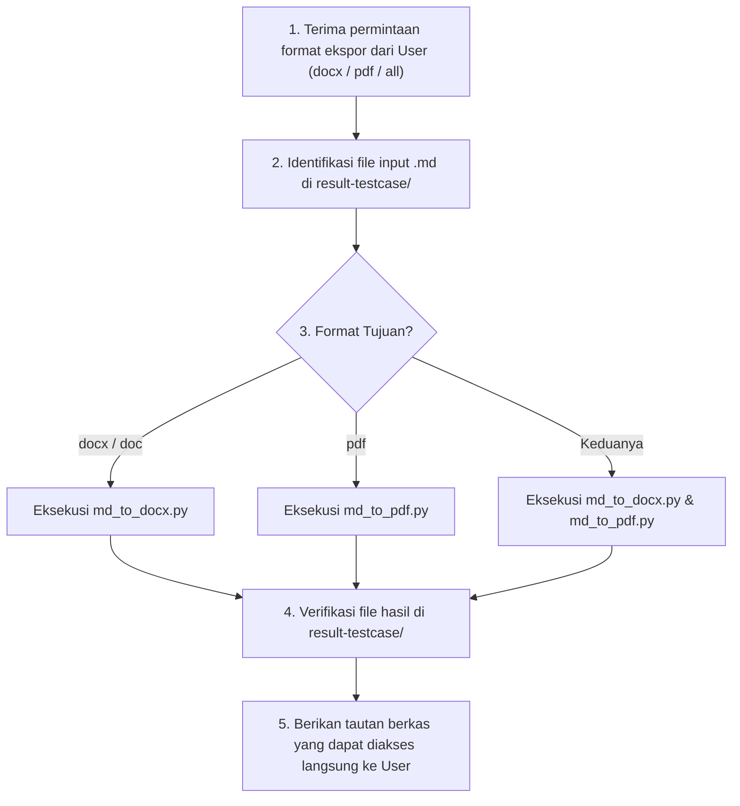

# Universal Document Conversion Skill (`convert-document`)

Skill ini digunakan untuk mengonversi dokumen hasil analisa PRD, Test Matrix, dan Test Execution Walkthrough (`.md`) menjadi format dokumen korporat profesional (**Word `.docx` / `.doc`** dan **PDF `.pdf`**) yang siap disajikan untuk Product Managers, Engineering Leads, dan Audit Reviewers berstandar **TIW (Test Idea & Walkthrough)**.

---

## 1. Lokasi Berkas & Skrip Pendukung Dinamis

- **Dokumen Sumber (Markdown)**: 
  - `./result-testcase/PRD_Analysis_<Feature_Name>.md` (atau path berkas `.md` kustom).
- **Skrip Konverter**:
  - Word Converter: `.agents/skills/convert-document/scripts/md_to_docx.py`
  - PDF Converter: `.agents/skills/convert-document/scripts/md_to_pdf.py`
- **Target Output**:
  - `./result-testcase/PRD_Analysis_<Feature_Name>.docx`
  - `./result-testcase/PRD_Analysis_<Feature_Name>.pdf`

---

## 2. Standar Struktur & Formatting TIW Universal

Dokumen Word dan PDF yang dihasilkan secara otomatis menyertakan:

1. **Executive Metadata Box**:
   - Judul Dokumen TIW (`[TIW] <Judul Analisis>`).
   - Tabel Atribut dengan shading abu-abu profesional (`#CCCCCC`):
     - `Product/Feature Name`: Nama fitur yang dianalisis.
     - `Target Platform`: Web Dashboard / Mobile iOS & Android / Backend API / Microservices.
     - `Supporting Docs`: PRD, Figma Link, OpenAPI/Swagger Spec, RBAC SSOT, DB DDL.
     - `Author / Contributor`: QA Lead / QA Engineer.
     - `Reviewers / Approvers`: Product Manager, Engineering Lead, QA Lead.
2. **Changelog Table**:
   - Format versi (`1.0.0`), tanggal analisa, deskripsi rilis, author, dan color mark.
3. **Approval Status Table**:
   - Status reviewer (`Pending`, `Approved`, `Changes Requested`), tanggal review, dan catatan approval.
4. **Isi Analisis Terstruktur**:
   - Heading hierarkis dengan typography bersih (Arial / Helvetica).
   - Bullet points & penomoran bernomor terstruktur.
   - Tabel Decision Matrix & Test Cases dengan aksen header **Cyan** (`#00FFFF`).
   - Tabel RBAC, BVA & NFR dengan aksen header **Gray** (`#CCCCCC`).
5. **Quality Gate & Release Go/No-Go Decision Matrix**:
   - Kriteria kelulusan rilis (0 Blocker bugs, $\ge 95\%$ pass rate, 100% RBAC security passed).
6. **Testing Evidence Guidelines & Review Log**:
   - Checklist bukti pengujian yang wajib dilampirkan (Screenshot visual, Network Har log/API payload 2xx/4xx, DB query snapshot).
   - Tabel pencatatan log review meeting dan tindak lanjut perbaikan.

---

## 3. Cara Menjalankan Konversi

### A. Konversi ke DOCX / DOC
Jalankan skrip Python:
```bash
python3 .agents/skills/convert-document/scripts/md_to_docx.py \
  result-testcase/PRD_Analysis_<Feature_Name>.md \
  result-testcase/PRD_Analysis_<Feature_Name>.docx
```

### B. Konversi ke PDF
Jalankan skrip Python:
```bash
python3 .agents/skills/convert-document/scripts/md_to_pdf.py \
  result-testcase/PRD_Analysis_<Feature_Name>.md \
  result-testcase/PRD_Analysis_<Feature_Name>.pdf
```

---

## 4. Alur Kerja Eksekusi (Execution Workflow)


