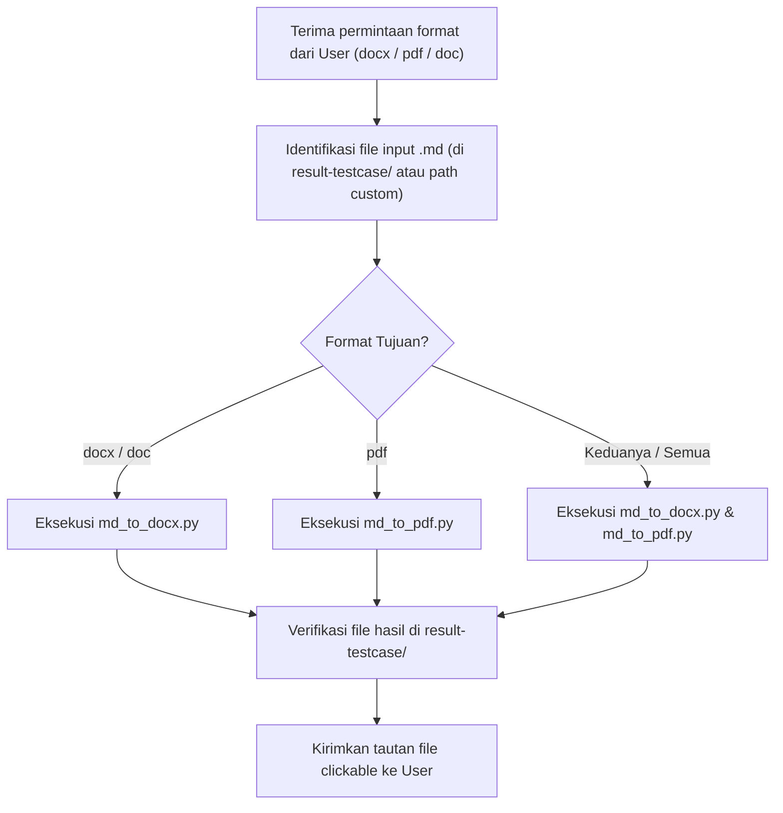

# Document Conversion Skill (`convert-document`)

Skill ini digunakan untuk mengonversi dokumen hasil analisa PRD & Test Matrix (`.md`) menjadi format dokumen profesional (**Word `.docx` / `.doc`** dan **PDF `.pdf`**) yang mengacu pada standar template **Everpro TIW (Test Idea & Walkthrough)**.

Dokumen acuan format: `Testcase-support/[TIW] Everpro Chat Reborn - Webhook OpenAPI.docx`

---

## 1. Lokasi Berkas & Skrip Pendukung

- **Dokumen Sumber (Markdown)**: 
  - `result-testcase/PRD_Analysis_<Feature_Name>.md` (atau path file `.md` lain yang ditentukan oleh user).
- **Skrip Konverter**:
  - Word Converter: `.agents/skills/convert-document/scripts/md_to_docx.py`
  - PDF Converter: `.agents/skills/convert-document/scripts/md_to_pdf.py`
- **Target Output**:
  - `result-testcase/PRD_Analysis_<Feature_Name>.docx`
  - `result-testcase/PRD_Analysis_<Feature_Name>.pdf`

---

## 2. Standar Struktur & Formatting TIW

Dokumen output yang dihasilkan secara otomatis menyertakan:

1. **Header & Metadata Table**:
   - Judul Dokumen TIW (`[TIW] <Judul Analisis>`).
   - Tabel 2 kolom dengan shading abu-abu (`#CCCCCC`) pada kolom atribut:
     - `Product/Feature Name`
     - `Supporting Docs` (PRD, Figma, RBAC SSOT, Adhoc Docs)
     - `Contributor` (`Eldo Fadlyady (QA Engineer)`)
     - `Approver` (`Rizky Nuredja, Elsa Vinietta`)
     - `Informed` (`Everpro Core Team, Product Management, Engineering`)
2. **Changelog Table**:
   - Format versi (`1.0.0`), tanggal rilis, deskripsi dokumen, update by, dan color mark.
3. **Approval Table**:
   - Status reviewer (`Pending`), tanggal, dan catatan approval.
4. **Isi Analisis Terstruktur**:
   - Heading 2 & 3 dengan hierarki rapi.
   - Bullet points & penomoran rapi.
   - Tabel Decision Matrix & Test Ideas dengan header aksen **Cyan** (`#00FFFF`).
   - Tabel RBAC & BVA dengan header aksen **Gray** (`#CCCCCC`).
5. **Feedbacks & Review Log Table**:
   - Tabel log review untuk mencatat masukan dari tim Product & Engineering.

---

## 3. Cara Menjalankan Konversi

### A. Konversi ke DOCX / DOC
Jalankan skrip Python:
```bash
python3 .agents/skills/convert-document/scripts/md_to_docx.py \
  result-testcase/PRD_Analysis_<Feature_Name>.md \
  result-testcase/PRD_Analysis_<Feature_Name>.docx
```

### B. Konversi ke PDF
Jalankan skrip Python:
```bash
python3 .agents/skills/convert-document/scripts/md_to_pdf.py \
  result-testcase/PRD_Analysis_<Feature_Name>.md \
  result-testcase/PRD_Analysis_<Feature_Name>.pdf
```

---

## 4. Alur Kerja (Workflow)


