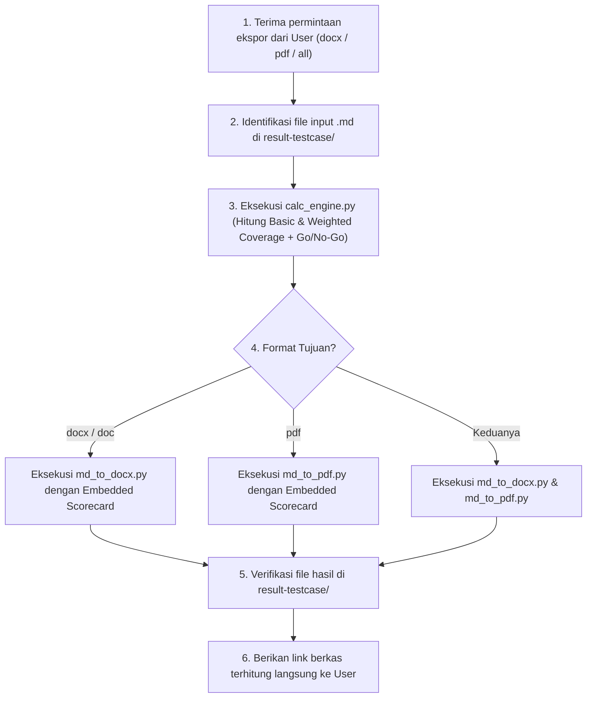

# Universal Document Conversion with Calculation Skill (`convert-with-calculation`)

Skill ini digunakan untuk mengonversi dokumen hasil analisa PRD, Test Matrix, dan Test Execution Walkthrough (`.md`) menjadi format dokumen korporat profesional (**Word `.docx` / `.doc`** dan **PDF `.pdf`**) yang dilengkapi dengan **Perhitungan Kuantitatif Otomatis (Weighted Risk Coverage Math Engine)** dan **Rekomendasi Keputusan Rilis Objektif (Go / Conditional Go / No-Go Decision Logic)** berstandar **TIW (Test Idea & Walkthrough)**.

---

## 1. Lokasi Berkas & Skrip Pendukung Dinamis

- **Dokumen Sumber (Markdown)**: 
  - `./result-testcase/PRD_Analysis_<Feature_Name>.md` (atau path berkas `.md` kustom).
- **Skrip Konverter & Engine Perhitungan**:
  - Calculation Engine: `.agents/skills/convert-with-calculation/scripts/calc_engine.py`
  - Word Converter: `.agents/skills/convert-with-calculation/scripts/md_to_docx.py`
  - PDF Converter: `.agents/skills/convert-with-calculation/scripts/md_to_pdf.py`
- **Target Output**:
  - `./result-testcase/PRD_Analysis_<Feature_Name>.docx`
  - `./result-testcase/PRD_Analysis_<Feature_Name>.pdf`

---

## 2. Model Perhitungan Metrik & Formula Bobot (Weighted Risk Math)

Skrip konversi secara otomatis mengekstraksi dan menghitung metrik berikut dari dokumen input:

### 1. Formula Cakupan Risiko Berbobot (Weighted Risk Coverage)

$$\text{Basic Coverage} = \frac{\text{Risiko Tercover}}{\text{Total Risiko}} \times 100\%$$

$$\text{Weighted Coverage} = \frac{\sum (\text{Bobot Risiko Tercover})}{\sum (\text{Total Bobot Risiko})} \times 100\%$$

| Level Risiko | Bobot Skor | Kriteria Bobot |
| :--- | :---: | :--- |
| **Critical** | **4** | Alur transaksi inti, kepatuhan finansial/regulasi, data security/BOLA. |
| **High** | **3** | Fitur sekunder terdampak tinggi, kegagalan kalkulasi, disrupsi operasional. |
| **Medium** | **2** | Reporting minor, sorting/filter lambat, terdapat workaround. |
| **Low** | **1** | Isu visual/kosmetik, alignment UI, tooltip hilang. |

### 2. Logika Keputusan Rilis Objektif (Go / No-Go Gate)

| Keputusan Rilis | Kriteria Logis Kuantitatif |
| :--- | :--- |
| **GO** | • Critical & High Risk Coverage = **100%**<br>• Requirements (Happy Path) Coverage = **100%**<br>• Weighted Risk Coverage $\ge$ **90%** |
| **CONDITIONAL GO** | • Critical & High Risk Coverage = **100%**<br>• Requirements Coverage $\ge$ **80%**<br>• Weighted Risk Coverage $\ge$ **85%**<br>• Seluruh celah terbuka hanya pada level Medium / Low |
| **NO-GO** | • Terdapat risiko Critical / High yang belum tercover (**< 100%**), ATAU<br>• Requirements Coverage **< 80%**, ATAU<br>• Weighted Risk Coverage **< 85%** |

---

## 3. Standar Struktur & Formatting TIW

Dokumen Word dan PDF yang dihasilkan secara otomatis menyertakan:

1. **Executive Metadata Box**:
   - Judul Dokumen TIW (`[TIW] <Judul Analisis>`).
   - Tabel Atribut (Product Name, Supporting Docs, Contributor, Approver, Informed).
2. **Changelog & Approval Table**:
   - Status reviewer (`Pending`, `Approved`, `Changes Requested`), tanggal review, dan catatan approval.
3. **Executive Quality Gate & Scorecard Table (Calculated)**:
   - Tabel ringkasan metrik kuantitatif terukur (Requirements Coverage, Critical/High Risk Coverage, Basic Coverage, Weighted Coverage).
   - Badge dan paragraf ringkasan status keputusan rilis: `[GO]`, `[CONDITIONAL GO]`, atau `[NO-GO]`.
4. **Isi Analisis Terstruktur**:
   - Heading hierarkis dengan typography bersih (Arial / Helvetica).
   - Bullet points & penomoran terstruktur.
   - Tabel Decision Matrix & Test Cases dengan aksen header **Cyan** (`#00FFFF`).
   - Tabel RBAC, BVA & NFR dengan aksen header **Gray** (`#CCCCCC`).
5. **Feedbacks & Review Log**:
   - Tabel pencatatan log review meeting dan tindak lanjut perbaikan.

---

## 4. Cara Menjalankan Konversi

### A. Konversi ke DOCX / DOC
```bash
python3 .agents/skills/convert-with-calculation/scripts/md_to_docx.py \
  result-testcase/PRD_Analysis_<Feature_Name>.md \
  result-testcase/PRD_Analysis_<Feature_Name>.docx
```

### B. Konversi ke PDF
```bash
python3 .agents/skills/convert-with-calculation/scripts/md_to_pdf.py \
  result-testcase/PRD_Analysis_<Feature_Name>.md \
  result-testcase/PRD_Analysis_<Feature_Name>.pdf
```

### C. Eksekusi Engine Perhitungan Mandiri (JSON Output)
```bash
python3 .agents/skills/convert-with-calculation/scripts/calc_engine.py \
  result-testcase/PRD_Analysis_<Feature_Name>.md
```

---

## 5. Alur Kerja Eksekusi (Execution Workflow)


