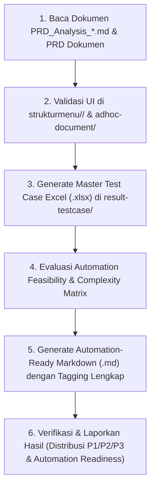

# Generate Test Case Suite Skill (`generate-testcase`)

Skill ini digunakan untuk mengubah hasil analisis PRD (`PRD_Analysis_<Feature_Name>.md`) dan dokumen PRD terkait menjadi **Master Test Case Suite** yang komprehensif, terstruktur, terukur, siap eksekusi manual/evidence development, dan siap diotomasi oleh agent lain.

---

## 1. Direktori & Lokasi Berkas (*File Architecture*)

- **Input PRD & Analisis (Fleksibel)**:
  - **Dokumen Analisis PRD (SSOT Input)**: `/Users/eldofadlyady/Documents/eldoTest/result-testcase/PRD_Analysis_<Feature_Name>.md` (dihasilkan dari skill `prd-qa-analyzer`).
  - **Dokumen PRD Asli**: Path spesifik file PRD di root workspace (`.docx`, `.pdf`, `.md`, dll.).
  - **Dokumen Teknis Ad-hoc (Tentative)**: `/Users/eldofadlyady/Documents/eldoTest/adhoc-document/` (jika tersedia).
- **Support & Template Knowledge**: `/Users/eldofadlyady/Documents/eldoTest/Testcase-support/`
  - `Test_Cases_Meta_New_Pricing_2026.xlsx` (**SSOT Template Excel**: Acuan pasti struktur sheet, format 15 kolom, styling warna, font, border, dan lebar kolom).
  - `quick-reply-crud.md` (**Template Markdown**: Acuan format penulisan step otomasi deklaratif).
  - Dokumen knowledge pendukung lainnya.
- **UI Structure Knowledge**: `/Users/eldofadlyady/Documents/eldoTest/strukturmenu/<app-name>/`
  - Referensi visual per aplikasi (`customer-dashboard/`, `dashboard-crm/`, `chatroom-web/`, dll.) untuk detail penamaan menu, label input field, button CTA, modal title, dan toast message nyata.
- **Target Output Test Cases**:
  1. **Master Spreadsheet Excel (Tahap 1)**: `/Users/eldofadlyady/Documents/eldoTest/result-testcase/Test_Cases_<Feature_Name>.xlsx`
  2. **Automation-Ready Markdown (Tahap 2)**: `/Users/eldofadlyady/Documents/eldoTest/result-testcase/test-cases-<feature-name>.md`

---

## 2. Urutan Proses Eksekusi Wajib (*Execution Flow*)

Proses pembuatan test case harus mengikuti urutan sekuensial berikut:



1. **Tahap 1 — Generate Master Test Case (.xlsx) (Wajib Pertama)**:
   - Dibuat terlebih dahulu sebagai **Single Source of Truth (Master Test Case)** untuk manual execution dan evidence development.
   - Mengikuti struktur acuan dari template `Testcase-support/Test_Cases_*.xlsx` (15 kolom standar).
   - Memetakan `user_story`, `precondition`, `priority`, `step_desc`, dan `expected_desc` secara granular.
2. **Tahap 2 — Generate Automation-Ready (.md) (Wajib Kedua)**:
   - Diturunkan langsung dari Master Test Case yang telah dibuat pada Tahap 1.
   - Diformat khusus dengan instruksi sekuensial (*Action $\rightarrow$ Assertion*) bernomor agar agent automation (Playwright/Cypress/Robot Framework) dapat membacanya tanpa ambiguitas.
   - **Wajib menyertakan Tagging Prioritas & Kompleksitas Otomasi** pada judul skenario untuk membantu QA/Developer menentukan urutan prioritas pembuatan script automation.

---

## 3. Pemanfaatan Knowledge UI (`strukturmenu/<app-name>/`)

- Saat merumuskan langkah pengetesan (`step_desc`) dan ekspektasi hasil (`expected_desc`), **wajib memeriksa dan mencocokkan dengan tangkapan layar/layout di sub-folder aplikasi terkait pada `strukturmenu/<app-name>/`**.
- Gunakan terminologi nyata pada UI aplikasi:
  - **Nama menu sidebar & header navigasi**: Misal: *Menu Chat Room*, *Pengaturan Flow*, *Broadcast Chat*.
  - **Label field input, placeholder, dropdown option**: Misal: `Nama Flow`, `Pilih Akun WhatsApp`, `Maksimum Penerima`.
  - **Nama button / Call-to-Action (CTA)**: Misal: `Simpan & Aktifkan`, `Tambah Step Baru`, `Ambil Alih Chat`.
  - **Posisi & tipe feedback**: Toast message (misal: `Flow berhasil disimpan`), modal konfirmasi (misal: `Konfirmasi Hapus Flow?`), alert banner, error message di bawah field (`Nama flow wajib diisi`).

---

## 4. Spesifikasi Standar Master Test Case Excel (`result-testcase/Test_Cases_<Feature_Name>.xlsx`)

Struktur dan styling wajib mengacu 100% pada template `Testcase-support/Test_Cases_Meta_New_Pricing_2026.xlsx`:

- **Sheet Name**: `Test Cases`
- **15 Kolom Standar & Lebar Kolom (Column Width)**:
  1. `project_id` (width: 12) — Kode project (misal: `EVERPRO_CHAT`)
  2. `suite_id` (width: 12) — Kode modul (misal: `CHAT_FLOW`)
  3. `unique_id` (width: 18) — **Format Hirarki UI**: `<APP>-<MAINMENU>-<SUBMENU>-<SEQ>`
     - Contoh: `CRC-DSH-COEX-001`, `CRW-CHT-ROOM-001`, `CDB-BRD-REG-001`
     - **`<APP>` (3-4 Huruf)**: Domain Aplikasi (misal: `CDB` = Customer Dashboard, `CRC` = CRM Dashboard, `CRW` = Chatroom Web, `MOB` = Mobile App, mengacu pada `strukturmenu/`).
     - **`<MAINMENU>` (3-4 Huruf)**: Menu Induk (misal: `DSH` = Dashboard, `CHT` = Chat, `BRD` = Broadcast, `CST` = Data Pelanggan, `SET` = Pengaturan).
     - **`<SUBMENU>` (3-4 Huruf)**: Sub-menu turunan (misal: `COEX` = Chat Flow / Orchestration, `QREP` = Quick Reply, `TMPL` = Template, `ANL` = Analytics).
     - **`<SEQ>` (3 Digit Angka)**: Nomor urut sekuensial yang dihasilkan berurutan per suite (`001`, `002`, `003`, dst.).
  4. `title` (width: 45) — Judul spesifik skenario uji
  5. `decription` (width: 45) — Deskripsi tujuan pengujian
  6. `precondition` (width: 45) — Prasyarat bernomor (1, 2, ...)
  7. `priority` (width: 15) — Nilai standar: `Low`, `Normal`, `High`, `Critical`
  8. `type` (width: 12) — `Functional`, `Negative`, `Security`, `Boundary`, `Regression`
  9. `status` (width: 12) — `Draft` / `Ready`
  10. `tags` (width: 12) — `Smoke`, `Regression`, `RBAC`, `Integration`
  11. `steps` (width: 12) — Jumlah total step (integer)
  12. `step_desc` (width: 45) — Langkah detail bernomor (1. ..., 2. ..., 3. ...)
  13. `expected_desc` (width: 45) — Ekspektasi hasil terukur bernomor (1. ..., 2. ..., 3. ...)
  14. `is_automated` (width: 14) — `FALSE` / `TRUE`
  15. `user_story` (width: 45) — Format gabungan Story & Priority Level: `[Priority: Critical/High/Normal/Low] US-xx: <Judul User Story> (Covers: AC-1, AC-2)`

- **Styling Header (Row 1)**:
  - Background Fill: Navy Solid (`#1F4E78` / `001F4E78`)
  - Font: Putih (`#FFFFFF`), Bold, Ukuran 11pt, Font Family Arial/Calibri
  - Alignment: Horizontal Center, Vertical Center
- **Styling Data Rows**:
  - `wrap_text = True` untuk kolom `title`, `decription`, `precondition`, `step_desc`, `expected_desc`, dan `user_story`.
  - Alignment Vertical: `top`.
  - Border: Thin Border abu-abu (`#D3D3D3` atau `#BFBFBF`) pada setiap cell.

---

## 5. Matriks & Tagging Automation Feasibility pada Markdown

Untuk membantu tim QA/Dev memprioritaskan pembuatan automated test script, setiap skenario pada file markdown **wajib diberi tagging status dan tingkat kompleksitas automasi**:

### A. Tagging Prioritas & Kompleksitas
1. **Prioritas Automasi**:
   - `[Auto-Critical]` / `[Auto-High]` / `[Auto-Normal]` / `[Auto-Low]` : Mengikuti skala prioritas skenario (Critical = Core/Blocker Flow, High = Validasi Kritis & Mutasi, Normal = Flow Sekunder/Filter, Low = UI/Estetika).
2. **Tingkat Kompleksitas (Automation Complexity)**:
   - `[Low-Complexity]` : Alur CRUD standar, navigasi halaman lurus, form input biasa, tanpa dependensi pihak ketiga (*Quick Wins* untuk langsung diotomasi).
   - `[Medium-Complexity]` : Alur multi-step modal, upload file/media, date-picker dinamis, filter/sorting kompleks.
   - `[High-Complexity]` : Melibatkan simulasi webhook eksternal (WhatsApp/Meta API), async queue/background worker, real-time socket events (Chatroom sync), multi-browser/multi-user concurrency (CS takeover), atau dependency OTP/3rd party.

> [!TIP]
> Skenario dengan tag `[Auto-Critical][Low-Complexity]` atau `[Auto-High][Low-Complexity]` adalah **Quick Wins** yang harus diotomasi terlebih dahulu karena memberikan coverage luas dengan waktu pengerjaan efisien. Skenario `[High-Complexity]` diposisikan untuk sprint automasi lanjutan.

---

## 6. Format Markdown Automation-Ready (`result-testcase/test-cases-<feature-name>.md`)

File Markdown disimpan di folder `result-testcase/` mengacu pada style template `Testcase-support/quick-reply-crud.md` yang diperkaya dengan tagging metadata:

```markdown
# Automation Test Cases: [Nama Fitur]

## Modul: [Nama Modul / User Story]

### CRC-DSH-COEX-001: [Judul Skenario] `[Auto-Critical]` `[Low-Complexity]`
- **User Story**: [Priority: Critical] US-01: Pembuatan Chat Flow Baru (Covers: AC-01, AC-02)
- **Tipe**: [Functional / Negative / RBAC / Boundary]
- **Precondition**:
  1. User login dengan akun role [Role Name] via API/Web.
  2. Data master [Nama Data] sudah terkonfigurasi.
- **Test Steps**:
  1. User membuka halaman `/path-menu`.
  2. User melihat komponen tabel data ter-load sempurna.
  3. User klik tombol `[Nama Button CTA]`.
  4. User mengisi input `[Label Field]` dengan value `"Sample Data"`.
  5. User klik `[Simpan]`.
  6. User melihat toast alert `"Data berhasil disimpan"`.
  7. User memastikan data `"Sample Data"` muncul pada baris pertama tabel.

---

### CRC-DSH-COEX-002: [Judul Skenario Handover / Concurrency] `[Auto-Critical]` `[High-Complexity]`
- **User Story**: [Priority: Critical] US-02: Realtime Handover CS (Covers: AC-03)
- **Tipe**: [Integration / Concurrency]
- **Precondition**:
  1. Sesi chat aktif dengan nomor customer +628123456789.
  2. Bot Flow sedang berjalan di status `Active`.
- **Test Steps**:
  1. User CS login dan membuka room `/chat-room/session-123`.
  2. User CS klik tombol `[Ambil Alih Chat]`.
  3. Sistem mengubah status flow menjadi `Off` secara real-time.
  4. User CS mengirimkan pesan `"Halo, ada yang bisa dibantu?"`.
  5. Sistem memastikan AI bot tidak mengirimkan auto-reply lanjutan.
```

---

## 7. Prinsip Anti-Redundansi & Deterministic QA

1. **DRY (Don't Repeat Yourself) Testing**:
   - Jangan menduplikasi skenario fungsional yang sama untuk setiap role.
   - Uji hak akses otorisasi secara terpusat pada kategori **RBAC**.
   - Fungsional modul dijalankan oleh role yang memiliki kewenangan penuh (*Authorized Role*).
2. **Deterministic & Atomic Assertions**:
   - Hindari kata ambigu (*"Pastikan data valid"*).
   - Gunakan ekspektasi hasil terukur (*"Muncul toast 'Berhasil disimpan'"*, *"Status badge berubah menjadi 'Aktif' dengan warna hijau"*).
3. **Strict In-Scope Mapping**:
   - Seluruh test case wajib diturunkan secara 100% konsisten dari section In-Scope & Decision Table yang tercantum pada `PRD_Analysis_<Feature_Name>.md`.

---

## 8. Langkah Kerja Bertahap (SOP Eksekusi)

1. **Baca Dokumen Analisis**: Buka dan pahami `result-testcase/PRD_Analysis_<Feature_Name>.md`.
2. **Pelajari UI & Layout**: Periksa referensi gambar visual pada sub-folder `strukturmenu/<app-name>/` dan file teknis di `adhoc-document/` (jika ada).
3. **Periksa Template Acuan**:
   - Struktur & style Excel: `Testcase-support/Test_Cases_Meta_New_Pricing_2026.xlsx`.
   - Format Markdown: `Testcase-support/quick-reply-crud.md`.
4. **Eksekusi Tahap 1 (Master Excel)**:
   - Buat script Python (menggunakan `openpyxl`) dengan spesifikasi styling di Bagian 4 untuk membuat `/Users/eldofadlyady/Documents/eldoTest/result-testcase/Test_Cases_<Feature_Name>.xlsx`.
   - Jalankan script dan pastikan file Excel berhasil dibuat dengan rapi, valid, dan lengkap 15 kolom.
5. **Eksekusi Tahap 2 (Markdown Automation-Ready)**:
   - Buat file `/Users/eldofadlyady/Documents/eldoTest/result-testcase/test-cases-<feature-name>.md` berdasarkan skenario di Master Excel dengan menyertakan tagging prioritas `[Auto-P*]` dan tingkat kompleksitas `[Low/Medium/High-Complexity]`.
6. **Verifikasi & Laporkan**:
   - Laporkan ringkasan total test case, distribusi prioritas (P1/P2/P3), pembagian complexity automasi, serta link kedua file di `result-testcase/` kepada user.

