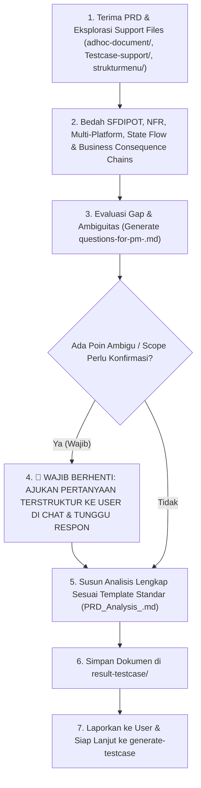

# Universal Business & Technical PRD Analysis Skill (`prd-analyzer-business`)

Skill ini dirancang sebagai standar baku **Senior QA, Quality Architect & Business QA Specialist** untuk melakukan **Analisis PRD Mendalam, Ekstraksi Requirement Multi-Dimensi (Functional & NFR), Pemodelan State & Decision Matrix, Pemetaan Hak Akses (RBAC/ABAC), Pemodelan Rantai Risiko Bisnis (Business Consequence Chains), dan Penegakan Gerbang Klarifikasi Terstruktur dengan Living PM Questions Management** sebelum test case dibuat.

Tujuan utama: Menghasilkan dokumen analisis yang **tajam secara bisnis, mendalam secara teknis arsitektur, zero-assumption, evidence-grade (layak audit & development), memiliki traceability jelas, dan bersifat Universal/Domain-Agnostic (dapat diterapkan pada Web SPA/SSR, Mobile App Android/iOS, Backend API/Microservices, Event-Driven/Kafka/Webhooks, Data Pipelines, hingga IoT)**.

---

## 1. Direktori & Lokasi Berkas Dinamis (*Dynamic File Architecture*)

Skill ini menggunakan path relatif workspace yang dinamis dan modular:

- **Dokumen PRD & TRD Input**: Terletak di root atau sub-folder workspace (misal: `./[PRD] Feature_Name.docx`, `.pdf`, `.md`, atau TRD teknis).
- **Support & Knowledge Base**: `./Testcase-support/`
  - Berisi dokumen acuan RBAC/Permissions SSOT, template standar, catatan arsitektur, dan `qa-learnings.md` (knowledge dari review sebelumnya).
- **UI & Interface Knowledge (Modular Adapter)**: `./strukturmenu/` atau `./ui-references/<app-name>/`
  - Berisi tangkapan layar, hierarki navigasi, nama menu, CTA, atau link desain (Figma/Wireframes) jika aplikasi memiliki antarmuka pengguna.
- **Technical & API Specifications (Ad-hoc)**: `./adhoc-document/`
  - Berisi OpenAPI/Swagger JSON, Postman Collection, GraphQL Schema, DB DDL/ERD, sequence diagram, atau catatan rilis teknis.
- **Target Output Analisis (2 Berkas Terpisah)**:
  1. **Dokumen Analisis Komprehensif**: `./result-testcase/PRD_Analysis_<Feature_Name>.md`
  2. **Living Questions for PM File**: `./result-testcase/questions-for-pm-<feature_name>.md`

---

## 2. Prinsip Utama Analisis QA & Heuristik Bisnis (Senior QA Heuristics)

### 1. 📖 EXHAUSTIVE DOCUMENT INGESTION & ZERO-OMISSION DISSECTION (Bedah Dokumen Menyeluruh)
- **Mandatory End-to-End Traversal**: Agent **WAJIB** membaca dan memetakan dokumen sumber (PRD, TRD, API Spec, lampiran arsitektur) dari baris awal hingga baris terakhir secara mendalam. Dilarang keras melakukan *skimming* atau melompat langsung ke sintesis konseptual tingkat tinggi.
- **Total Extraction of Explicit Tables & Scenarios**: Setiap tabel data, matriks transisi status, diagram alur, sampel skenario pengujian, atau aturan kalkulasi yang tercantum di dalam dokumen input **WAJIB diekstrak 100% ke dalam dokumen analisis**.
- **Proactive Combinatorial Extension**: Setelah seluruh skenario eksplisit dari dokumen sumber terpetakan, Agent wajib mengembangkan (*extend*) skenario tersebut secara proaktif ke kondisi batas (*boundary*), fluktuasi *in-transit*, *out-of-order events*, *race conditions*, dan skenario kegagalan (*resilience/debt*).

### 2. 🛑 STRICT NO-ASSUMPTION & MANDATORY INTERACTIVE CLARIFICATION GATE (Wajib Berhenti & Bertanya)
- **Zero-Wild-Guess Policy**: Agent **DILARANG KERAS** mengasumsikan sendiri aturan bisnis yang belum lengkap, rumus kalkulasi/pricing yang ambigu, batas limit kuota/timeout yang tidak tertulis, penanganan error code yang kosong, perilaku sistem saat kondisi offline/kegagalan, **MENGARANG PATH URL/SCHEMA ENDPOINT API** jika tidak ada OpenAPI/TRD resmi di `./adhoc-document/` (wajib menggunakan narasi pendekatan fungsional yang netral), atau **MENGARANG POHON HIERARKI MENU UI** yang tidak terdapat pada teks PRD atau tangkapan layar `./strukturmenu/`.
- **Strict Isolation of Living PM Questions**: Pertanyaan klarifikasi yang belum dijawab secara resmi oleh Product Manager (PM) **DILARANG KERAS dijawab sendiri oleh Agent**; seluruh pertanyaan terbuka wajib disimpan di file `./result-testcase/questions-for-pm-<feature>.md` dan ditandai `[PENDING PM CLARIFICATION]`.
- **Strict Grep-Before-Answer Communication**: Saat menjawab konfirmasi atau menyebutkan ID Test Case, nomor baris, atau nama tabel di dalam chat, Agent **WAJIB melakukan pencarian eksak (`grep_search` / `view_file`) ke file fisik terlebih dahulu** untuk mencegah halusinasi kode ID.
- **Menu & UI Navigation Grounding (`./strukturmenu/`)**:
  - Periksa teks PRD dan seluruh tangkapan layar di `./strukturmenu/` untuk memverifikasi apakah suatu menu, tombol CTA, atau modal dialog **benar-benar ada** atau **tidak ada**.
  - Tentukan alur navigasi klik yang nyata (contoh: Klik Menu A $\rightarrow$ Klik Submenu B $\rightarrow$ Klik CTA C).
  - Untuk modul internal/backend tanpa screen capture di `./strukturmenu/` dan tanpa mockup di PRD (misal portal internal Biz Ops Admin), sebutkan modul fungsional PRD secara netral (misal `[Credit Management - Admin]`) tanpa mengarang alur menu fiktif.
- **Preventative Interactive Clarification Gate (Mandatory Pause & Ask)**:
  - Sebelum menulis dokumen analisis final, jika terdapat informasi yang masih **abu-abu** (baik aturan bisnis, kalkulasi, maupun keberadaan menu/antarmuka UI), Agent **WAJIB berhenti dan mengajukan daftar pertanyaan klarifikasi terstruktur kepada User di chat**.
  - **Pilihan Respon User**:
    1. *User Melengkapi Informasi*: Jawaban dikunci dan diintegrasikan secara presisi ke dalam dokumen analisis.
    2. *User Memilih Skip / Belum Menjawab*: Seluruh pertanyaan yang di-skip dicatat ke berkas terpisah `./result-testcase/questions-for-pm-<feature>.md` dan bagian terkait di dokumen ditandai `[PENDING PM CLARIFICATION]`.
    3. *User Meminta Default / Konfirmasi Data Belum Ada*: Terapkan **Standar Nilai Default Netral** (UI menggunakan modul fungsional `[Nama Modul - Role]`, API menggunakan narasi kontrak fungsional `[Service/Contract] <Service>...`).
- **7 Dimensi Checklist Klarifikasi Wajib**:
  1. *Business Logic & Formula Invariants*: Rumus eksak kalkulasi, pembulatan desimal, currency conversion, kondisi diskon/tiering.
  2. *Scope Guardrails*: Batasan tegas apa yang **In-Scope** vs **Out-of-Scope** pada iterasi ini.
  3. *Role & Authorization Boundaries*: Izin aksi per role (View, Create, Edit, Delete, Export, Approve, Direct API/URL access).
  4. *Error Response & Failure Fallbacks*: Apa yang terjadi saat provider pihak ketiga down, network timeout 504, saldo habis, atau request gagal?
  5. *Data Lifecycle & Invariants*: Siklus hidup entitas (Draft $\rightarrow$ Active $\rightarrow$ Inactive $\rightarrow$ Soft-deleted), kebijakan retensi data, dan PII masking.
  6. *Concurrency & Idempotency*: Pencegahan transaksi ganda akibat double-click CTA atau retry network.
  7. *Platform & Environment Constraints*: Versi OS/browser minimum, device compatibility, throttling network, token expiry duration.

- **Pemisahan Dua Jalur Pertanyaan (Two-Track Gating)**:
  1. *Track 1 (Pertanyaan untuk QA Engineer / User)*: Keputusan scope, modul target, konteks rilis $\rightarrow$ Dijawab langsung oleh User di chat.
  2. *Track 2 (Pertanyaan untuk Product Manager / PM)*: Aturan bisnis mendalam atau validasi form yang tidak tercantum di dokumen $\rightarrow$ Otomatis dicatat ke berkas terpisah `result-testcase/questions-for-pm-<feature>.md`.
  - Jika User dapat menjawab pertanyaan PM langsung di chat, Agent akan mencatat jawabannya dan mengupdate status menjadi `Answered`.
  - Jika User belum memiliki jawabannya (karena perlu dikonfirmasi ke PM atau memilih skip), Agent tetap menyimpan file `questions-for-pm` untuk diserahkan ke PM dan menandai bagian tersebut di dokumen analisis sebagai `[PENDING PM CLARIFICATION]`.

### 2. 🎯 BUSINESS RISK CONSEQUENCE CHAINS (6 Business Impact Pillars)
Setiap risiko tidak boleh hanya ditulis sebagai temuan teknis dangkal ("tombol error" atau "menu terbuka"), melainkan wajib dimodelkan menggunakan **Rantai Konsekuensi Bisnis**:

$$\mathbf{[\text{Failure Scenario}] \longrightarrow [\text{Chain of Consequences}] \longrightarrow [\text{Business Impact}]}$$

Setiap risiko wajib dievaluasi terhadap **6 Pilar Dampak Bisnis**:
1. **Financial**: Potensi kerugian finansial langsung, salah kalkulasi tarif/diskon, refund, denda, kebocoran saldo/ongkir.
2. **Operational**: Disrupsi alur operasional internal/CS/gudang, penanganan manual yang memakan waktu, penurunan produktivitas tim.
3. **Customer**: Komplain pengguna, churn rate meningkat, hilangnya kepercayaan pelanggan, pelanggaran SLA transaksi.
4. **Compliance**: Pelanggaran regulasi perbankan/keuangan, kegagalan audit, kebocoran data pribadi (PII).
5. **Reputational**: Kerusakan citra brand, ulasan negatif publik/media sosial, penurunan rating aplikasi.
6. **Support**: Lonjakan volume tiket komplain, eskalasi penanganan ke manajemen, beban tim CS meningkat.

#### Sistem Penilaian Risiko & Bobot (*Weighted Risk Scoring*):
- **Impact**: High / Medium / Low
- **Likelihood**: High / Medium / Low
- **Matriks Level Risiko & Bobot**:
  - **Critical (Bobot: 4)**: Dampak Finansial besar (>Rp 10jt), kegagalan alur transaksi inti, celah otorisasi/BOLA, kepatuhan hukum.
  - **High (Bobot: 3)**: Dampak operasional signifikan, kalkulasi fitur sekunder salah, eskalasi komplain tinggi.
  - **Medium (Bobot: 2)**: Ketidaknyamanan user dengan workaround, kesalahan reporting minor, filter lambat.
  - **Low (Bobot: 1)**: Isu kosmetik, alignment UI, tooltip hilang, edge case pada fitur yang jarang digunakan.

### 3. 🌐 UNIVERSAL MULTI-PLATFORM ADAPTER
Analisis harus secara otomatis menyesuaikan karakteristik arsitektur sistem target:
- **Web Applications (SPA / SSR)**: Evaluasi browser history, multiple tabs sync, cookie/session management, responsive layout, reload page state, keyboard navigation.
- **Mobile Applications (iOS / Android / Flutter / React Native)**: Evaluasi app lifecycle (background/kill/resume), permission requests (Camera, GPS, Storage), push notification payload, biometrics (FaceID/Fingerprint), offline local storage (SQLite/Hive) sync.
- **Backend APIs & Microservices (REST / GraphQL / gRPC)**: Evaluasi HTTP Status Code (2xx, 4xx, 5xx), request-response JSON contract schema, headers (Authorization, X-Request-ID, Idempotency-Key), rate limiting (429), payload validation, BOLA/IDOR vulnerability.
- **Event-Driven & Asynchronous Systems (Webhooks / Message Broker / Kafka / RabbitMQ)**: Evaluasi message delivery guarantee (at-least-once), retry policy & exponential backoff, dead-letter queue (DLQ), payload deduplication, out-of-order event handling.

### 4. 🧠 SFDIPOT HEURISTIC REQUIREMENT MODELING
Gunakan kerangka berpikir SFDIPOT (James Bach HTSM) untuk membedah setiap requirement secara holistik:
- **Structure**: Struktur kode, dependensi library, konfigurasi environment flag.
- **Function**: Seluruh fungsionalitas input-proses-output yang dilakukan oleh sistem.
- **Data**: Karakteristik data input/output, boundary values, tipe data, enkripsi, dan mutasi DB.
- **Interfaces**: UI components, REST endpoints, webhooks, file import/export (CSV, Excel, PDF).
- **Platform**: Platform eksekusi, OS, web browser, hardware limit, network bandwidth.
- **Operations**: Pola penggunaan user nyata, variasi persona, volume beban harian.
- **Time**: Asinkronus, delay timeout, masa kedaluwarsa token/OTP, timezone UTC vs Local time.

### 5. 🔒 NON-FUNCTIONAL REQUIREMENTS (NFR) & SECURITY GUARDRAILS
Dokumen analisis wajib mencakup analisa ketat terhadap:
- **Idempotency**: Memastikan request mutasi kritis (pembayaran, pengurangan kuota, pembuatan data) aman dari duplikasi.
- **State Invariants**: Entitas tidak boleh melompati status yang dilarang (misal: dari `Rejected` tidak boleh langsung menjadi `Completed`).
- **Security & OWASP Guardrails**: Pengecekan otorisasi di level API/Object (mencegah manipulasi `user_id` pada URL/payload), sanitasi input (XSS/SQLi), dan perlindungan data pribadi (PII).
- **Graceful Degradation**: Sistem tetap menampilkan feedback informatif (fallback message) saat dependensi eksternal gagal merespons.

---

## 3. Metodologi Pengujian & Skala Prioritas Industri

### A. Testing Methods
- **Decision Table Testing (DT)**: Pemetaan seluruh kombinasi logika multi-variabel.
- **State Transition Testing (ST)**: Pemodelan siklus hidup status data beserta transisi valid vs invalid.
- **Boundary Value Analysis (BVA)**: Pengujian nilai batas (Min-1, Min, Normal, Max, Max+1, Extreme Values).
- **Equivalence Partitioning (EP)**: Pembagian kelas input valid vs invalid.
- **Access Control & RBAC/BOLA Testing (AC)**: Pengujian hak akses per role, direct URL access, dan otorisasi API backend.
- **Negative & Resiliency Testing (RES)**: Penanganan invalid payload, network drop, timeout, dan rollback integritas data.
- **Concurrency & Race Condition Testing (CONC)**: Pengujian klik simultan, multi-user update pada baris data yang sama.

### B. Priority Matrix & Bobot Risiko Standar Industri
- **P1 (Critical / Blocker - Bobot: 4)**: Alur transaksi keuangan/kredit, mutasi data inti, penegakan isolasi tenant/data security, rollback integrity, pencegahan bypass auth, dan core happy path.
- **P2 (High - Bobot: 3)**: Validasi otorisasi RBAC, kalkulasi real-time, filter/sorting/pagination kompleks, boundary data, format input wajib, dan ekspor data.
- **P3 (Medium / Normal - Bobot: 2)**: Alur sekunder dengan workaround, kesalahan reporting minor, filter lambat.
- **P4 (Low - Bobot: 1)**: Format visual UI/UX, tooltip, micro-animation, log sekunder, dan pesan error minor.

---

## 4. Struktur Standar Dokumen Hasil Analisis (`result-testcase/PRD_Analysis_<Feature_Name>.md`)

Dokumen analisis wajib memiliki hierarki standar berikut:

```markdown
# Analisis PRD & Perancangan Test Matrix: [Nama Fitur]

## 1. Ringkasan Fitur & Scope Guardrails
- **Tujuan Fitur**: Penjelasan nilai bisnis dan fungsionalitas inti (1-2 paragraf).
- **Arsitektur & Domain Platform**: [Web SPA / Mobile App iOS-Android / Backend API / Event-Driven Microservice].
- **Referensi Interface & Pengetahuan Pendukung**: [Path UI di strukturmenu/, OpenAPI Spec, atau Figma Link].
- **In-Scope**: Modul, alur, dan batasan fungsional yang secara tegas diuji pada iterasi ini.
- **Out-of-Scope**: Fitur/modul di luar cakupan yang tidak terdampak atau ditunda pada rilis ini.

## 2. Prasyarat Sistem & Konfigurasi Lingkungan (Pre-requisites)
- Konfigurasi environment flag, akun uji, role permissions, master data awal, dependency service, atau token autentikasi.

## 3. Matriks Hak Akses & Otorisasi Keamanan (RBAC & Authorization Matrix)
- Tabel pemetaan Role Pengguna vs Modul/Endpoint/Aksi (View, Create, Edit, Delete, Export, Approve, Direct API).
- Penegakan proteksi BOLA/IDOR di layer API backend.

## 4. Product Risk Register & Business Consequence Chains
| Risk ID | Failure Scenario & Business Consequence Chain | Impact | Likelihood | Risk Level | Weight | Pillar | Mitigation Strategy |
| :--- | :--- | :--- | :--- | :--- | :--- | :--- | :--- |
| [FTR]-RSK-001 | [Failure Scenario] -> [Chain of Consequences] -> [Business Impact] | High | High | Critical | 4 | Financial | 3-Value BVA + API & DB Assertion |

## 5. Pemodelan Logika Bisnis, State Transition & Decision Matrix
- **Decision Table / BVA Matrix**: Tabel kombinasi logika bisnis multi-kondisi beserta expected action.
- **State Transition Flow & Invariants**: Diagram/tabel siklus hidup status entitas (termasuk transisi yang dilarang).

## 6. Non-Functional Requirements, Integrasi Teknis & Error Handling
- **Idempotency & Concurrency Guardrails**: Mekanisme penanganan double-submit dan simultaneous update.
- **API & Third-Party Integration Resiliency**: Timeout threshold, fallback responses, circuit breaker, retry policy.
- **Validation & Sanitization**: Validasi format field, batas ukuran file, sanitasi XSS/SQLi.
- **Data Persistence & Rollback Impact**: Integritas data DB saat transaksi dibatalkan atau gagal di tengah jalan.

## 7. Requirements Traceability Matrix (RTM)
- Tabel pemetaan dua arah: `User Story / PRD Section` ↔ `Acceptance Criteria (AC)` ↔ `Target Test Area` ↔ `Risk Ref` ↔ `Planned Priority`.

## 8. Dampak Regresi (Impact & Regression Scope)
- Fitur existing, modul upstream/downstream, dan database schema yang berpotensi terdampak oleh perubahan ini.

## 9. Catatan Klarifikasi & Keputusan Produk (Clarification & Alignment Log)
- Rangkuman pertanyaan terstruktur yang telah diajukan ke User/PO/Dev beserta keputusan final yang telah disepakati (merujuk ke file questions-for-pm).
```

---

## 5. Format Berkas Living Questions for PM (`result-testcase/questions-for-pm-<feature>.md`)

```markdown
# Questions for Product Manager (PM): [Nama Fitur]

> Dokumen ini berisi daftar pertanyaan klarifikasi terkait aturan bisnis, validasi, toleransi SLA, dan edge case yang belum tercantum secara eksplisit pada PRD/TRD.
> Mohon diisi pada kolom **Answer** sebelum proses perancangan test case difinalisasi.

| # | Related AC / Section | Question & Context | Impact if Unresolved | Status | Answer |
|---|---|---|---|---|---|
| Q-01 | AC-01 / Section 3.1 | [Pertanyaan spesifik] | [Dampak jika tidak dijawab] | Open | [Jawaban PM] |
| Q-02 | AC-02 / Formula Pricing | [Pertanyaan spesifik] | [Dampak jika tidak dijawab] | Open | [Jawaban PM] |
```

---

## 6. Langkah Kerja Bertahap (SOP Analisis PRD)



1. **Eksplorasi Input & Konteks Pendukung**:
   - Baca PRD & TRD yang diberikan oleh user.
   - Periksa `./Testcase-support/` untuk aturan RBAC, template, dan file `qa-learnings.md` (pelajaran dari sprint sebelumnya).
   - Periksa `./adhoc-document/` jika terdapat OpenAPI/Swagger, DB Schema, atau dokumentasi teknis lainnya.
   - Periksa `./strukturmenu/` atau link Figma jika fitur memiliki antarmuka pengguna.
2. **Bedah Kebutuhan secara Mendalam (SFDIPOT, NFR & Business Risk Chains)**:
   - Identifikasi alur logika bisnis, state lifecycle, rumus, batasan limit, integrasi pihak ketiga, dan potensi celah keamanan.
   - Susun **Product Risk Register** dengan format rantai konsekuensi bisnis (`[Failure] -> [Chain] -> [Impact]`) dan 6 pilar dampak bisnis (Financial, Ops, Customer, Compliance, Reputational, Support) serta bobot $4/3/2/1$.
3. **Ekstraksi Ambiguitas & Living PM Questions File**:
   - Buat dan simpan berkas `./result-testcase/questions-for-pm-<feature>.md` dengan nomor urut sekuensial (`Q-01`, `Q-02`, dst.).
4. **Gerbang Klarifikasi Interaktif (Interactive Clarification Gate)**:
   - Susun daftar pertanyaan yang mencakup 7 Dimensi Checklist Klarifikasi.
   - **🛑 TANYA KE USER DI CHAT dan TUNGGU JAWABAN**. Jangan pernah membuat dokumen final dengan asumsi tanpa konfirmasi.
5. **Penyusunan Dokumen Analisis Final**:
   - Setelah seluruh klarifikasi disepakati (atau ditandai pending PM), susun dokumen analisis komprehensif mengikuti Bagian 4.
6. **Penyimpanan Dokumen**:
   - Simpan dokumen ke: `./result-testcase/PRD_Analysis_<Feature_Name>.md`.
7. **Laporan & Handover**:
   - Laporkan ringkasan temuan kritis, scope boundary yang telah terkunci, dan informasikan bahwa dokumen siap diturunkan ke skill `generate-testcase`.

---

## 7. Protokol Anti-Regresi & Pencegahan Konflik Aturan (Universal Guardrail)

> [!CAUTION]
> **PRINSIP KEKEBALAN DAN KONSISTENSI SKILL (ANTI-REGRESSION POLICY):**
> 1. **Dilarang Mengubah/Menghapus Rule Tanpa Persetujuan**: Seluruh aturan fundamental yang sudah stabil pada skill ini **TIDAK BOLEH diubah, diganti, atau dihapus sepihak oleh AI**, kecuali penambahan aturan baru tersebut terbukti objektif lebih baik dan telah disetujui oleh User.
> 2. **Pre-Calibration Sanity & Conflict Check**: Setiap pembaruan atau penambahan aturan baru harus dipastikan **TIDAK BERTENTANGAN** dengan guardrail fundamental (*Zero-Wild-Guess Policy*, grounding visual `./strukturmenu/`, *Living PM Questions Management*, *Mandatory Clarification Gate*). Aturan baru harus bersifat memperketat / melengkapi (*additive/enriching*), bukan membatalkan aturan dasar.

