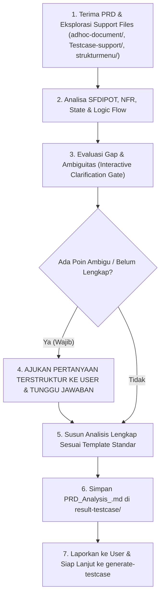

# Universal PRD & Requirement Analysis Skill (`prd-qa-analyzer`)

Skill ini dirancang sebagai standar baku **Senior QA & Quality Architect** untuk melakukan **Analisis PRD Mendalam, Ekstraksi Requirement Multi-Dimensi (Functional & NFR), Pemodelan State & Decision Matrix, Pemetaan Hak Akses (RBAC/ABAC), dan Penegakan Gerbang Klarifikasi Terstruktur** sebelum test case dibuat.

Tujuan utama: Menghasilkan dokumen analisis yang **tajam, zero-assumption, akurat, evidence-grade (layak audit & development), memiliki traceability jelas, dan bersifat Universal/Domain-Agnostic (dapat diterapkan pada Web, Mobile App Android/iOS, Backend API/Microservices, Event-Driven/Webhooks, Data Pipelines, hingga IoT)**.

---

## 1. Direktori & Lokasi Berkas Dinamis (*Dynamic File Architecture*)

Skill ini menggunakan path relatif workspace yang dinamis dan modular:

- **Dokumen PRD Input**: Terletak di root atau sub-folder workspace (misal: `./[PRD] Feature_Name.docx`, `.pdf`, atau `.md`).
- **Support & Knowledge Base**: `./Testcase-support/`
  - Berisi dokumen acuan RBAC/Permissions SSOT, template standar, catatan arsitektur, dan `qa-learnings.md` (knowledge dari review sebelumnya).
- **UI & Interface Knowledge (Modular Adapter)**: `./strukturmenu/` atau `./ui-references/<app-name>/`
  - Berisi tangkapan layar, hierarki navigasi, nama menu, CTA, atau link desain (Figma/Wireframes) jika aplikasi memiliki antarmuka pengguna.
- **Technical & API Specifications (Ad-hoc)**: `./adhoc-document/`
  - Berisi OpenAPI/Swagger JSON, Postman Collection, GraphQL Schema, DB DDL/ERD, sequence diagram, atau catatan rilis teknis.
- **Target Output Analisis**: `./result-testcase/PRD_Analysis_<Feature_Name>.md`

---

## 2. Prinsip Utama Analisis QA (Senior QA Heuristics)

### 1. 🛑 STRICT NO-ASSUMPTION & INTERACTIVE CLARIFICATION GATE (Wajib Berhenti & Bertanya)
- **Zero-Wild-Guess Policy**: Agent **DILARANG KERAS** mengasumsikan sendiri aturan bisnis yang belum lengkap, rumus kalkulasi/pricing yang ambigu, batas limit kuota/timeout yang tidak tertulis, penanganan error code yang kosong, atau perilaku sistem saat kondisi offline/kegagalan.
- **Interactive Clarification Gate**: Sebelum menulis dokumen analisis final, Agent **WAJIB berhenti dan mengajukan daftar pertanyaan klarifikasi terstruktur kepada User**.
- **7 Dimensi Checklist Klarifikasi Wajib**:
  1. *Business Logic & Formula Invariants*: Rumus eksak kalkulasi, pembulatan desimal, currency conversion, kondisi diskon/tiering.
  2. *Scope Guardrails*: Batasan tegas apa yang **In-Scope** vs **Out-of-Scope** pada iterasi ini.
  3. *Role & Authorization Boundaries*: Izin aksi per role (View, Create, Edit, Delete, Export, Approve, Direct API/URL access).
  4. *Error Response & Failure Fallbacks*: Apa yang terjadi saat provider pihak ketiga down, network timeout 504, saldo habis, atau request gagal?
  5. *Data Lifecycle & Invariants*: Siklus hidup entitas (Draft $\rightarrow$ Active $\rightarrow$ Inactive $\rightarrow$ Soft-deleted), kebijakan retensi data, dan PII masking.
  6. *Concurrency & Idempotency*: Pencegahan transaksi ganda akibat double-click CTA atau retry network.
  7. *Platform & Environment Constraints*: Versi OS/browser minimum, device compatibility, throttling network, token expiry duration.

### 2. 🌐 UNIVERSAL MULTI-PLATFORM ADAPTER
Analisis harus secara otomatis menyesuaikan karakteristik arsitektur sistem target:
- **Web Applications (SPA / SSR)**: Evaluasi browser history, multiple tabs sync, cookie/session management, responsive layout, reload page state, keyboard navigation.
- **Mobile Applications (iOS / Android / Flutter / React Native)**: Evaluasi app lifecycle (background/kill/resume), permission requests (Camera, GPS, Storage), push notification payload, biometrics (FaceID/Fingerprint), offline local storage (SQLite/Hive) sync.
- **Backend APIs & Microservices (REST / GraphQL / gRPC)**: Evaluasi HTTP Status Code (2xx, 4xx, 5xx), request-response JSON contract schema, headers (Authorization, X-Request-ID, Idempotency-Key), rate limiting (429), payload validation, BOLA/IDOR vulnerability.
- **Event-Driven & Asynchronous Systems (Webhooks / Message Broker / Kafka / RabbitMQ)**: Evaluasi message delivery guarantee (at-least-once), retry policy & exponential backoff, dead-letter queue (DLQ), payload deduplication, out-of-order event handling.

### 3. 🧠 SFDIPOT HEURISTIC REQUIREMENT MODELING
Gunakan kerangka berpikir SFDIPOT (James Bach HTSM) untuk membedah setiap requirement secara holistik:
- **Structure**: Struktur kode, dependensi library, konfigurasi environment flag.
- **Function**: Seluruh fungsionalitas input-proses-output yang dilakukan oleh sistem.
- **Data**: Karakteristik data input/output, boundary values, tipe data, enkripsi, dan mutasi DB.
- **Interfaces**: UI components, REST endpoints, webhooks, file import/export (CSV, Excel, PDF).
- **Platform**: Platform eksekusi, OS, web browser, hardware limit, network bandwidth.
- **Operations**: Pola penggunaan user nyata, variasi persona, volume beban harian.
- **Time**: Asinkronus, delay timeout, masa kedaluwarsa token/OTP, timezone UTC vs Local time.

### 4. 🔒 NON-FUNCTIONAL REQUIREMENTS (NFR) & SECURITY GUARDRAILS
Dokumen analisis wajib mencakup analisa ketat terhadap:
- **Idempotency**: Memastikan request mutasi kritis (pembayaran, pengurangan kuota, pembuatan data) aman dari duplikasi.
- **State Invariants**: Entitas tidak boleh melompati status yang dilarang (misal: dari `Rejected` tidak boleh langsung menjadi `Completed`).
- **Security & OWASP Guardrails**: Pengecekan otorisasi di level API/Object (mencegah manipulasi `user_id` pada URL/payload), sanitasi input (XSS/SQLi), dan perlindungan data pribadi (PII).
- **Graceful Degradation**: Sistem tetap menampilkan feedback informatif (fallback message) saat dependensi eksternal gagal merespons.

---

## 3. Metodologi Pengujian & Skala Prioritas Industri

### A. Testing Methods
- **Decision Table Testing (DT)**: Pemetaan seluruh kombinasi logika multi-variabel.
- **State Transition Testing (ST)**: Pemodelan siklus hidup status data beserta transisi valid vs invalid.
- **Boundary Value Analysis (BVA)**: Pengujian nilai batas (Min-1, Min, Normal, Max, Max+1, Extreme Values).
- **Equivalence Partitioning (EP)**: Pembagian kelas input valid vs invalid.
- **Access Control & RBAC/BOLA Testing (AC)**: Pengujian hak akses per role, direct URL access, dan otorisasi API backend.
- **Negative & Resiliency Testing (RES)**: Penanganan invalid payload, network drop, timeout, dan rollback integritas data.
- **Concurrency & Race Condition Testing (CONC)**: Pengujian klik simultan, multi-user update pada baris data yang sama.

### B. Priority Matrix Standar Industri
- **P1 (Critical / Blocker)**: Alur transaksi keuangan/kredit, mutasi data inti, penegakan isolasi tenant/data security, rollback integrity, pencegahan bypass auth, dan core happy path.
- **P2 (High)**: Validasi otorisasi RBAC, kalkulasi real-time, filter/sorting/pagination kompleks, boundary data, format input wajib, dan ekspor data.
- **P3 (Medium / Low)**: Format visual UI/UX, tooltip, micro-animation, log sekunder, dan pesan error minor.

---

## 4. Struktur Standar Dokumen Hasil Analisis (`result-testcase/PRD_Analysis_<Feature_Name>.md`)

Dokumen analisis wajib memiliki hierarki standar berikut:

```markdown
# Analisis PRD & Perancangan Test Matrix: [Nama Fitur]

## 1. Ringkasan Fitur & Scope Guardrails
- **Tujuan Fitur**: Penjelasan nilai bisnis dan fungsionalitas inti (1-2 paragraf).
- **Arsitektur & Domain Platform**: [Web SPA / Mobile App iOS-Android / Backend API / Event-Driven Microservice].
- **Referensi Interface & Pengetahuan Pendukung**: [Path UI di strukturmenu/, OpenAPI Spec, atau Figma Link].
- **In-Scope**: Modul, alur, dan batasan fungsional yang secara tegas diuji pada iterasi ini.
- **Out-of-Scope**: Fitur/modul di luar cakupan yang tidak terdampak atau ditunda pada rilis ini.

## 2. Prasyarat Sistem & Konfigurasi Lingkungan (Pre-requisites)
- Konfigurasi environment flag, akun uji, role permissions, master data awal, dependency service, atau token autentikasi.

## 3. Matriks Hak Akses & Otorisasi Keamanan (RBAC & Authorization Matrix)
- Tabel pemetaan Role Pengguna vs Modul/Endpoint/Aksi (View, Create, Edit, Delete, Export, Approve, Direct API).
- Penegakan proteksi BOLA/IDOR di layer API backend.

## 4. Pemodelan Logika Bisnis, State Transition & Decision Matrix
- **Decision Table / BVA Matrix**: Tabel kombinasi logika bisnis multi-kondisi beserta expected action.
- **State Transition Flow & Invariants**: Diagram/tabel siklus hidup status entitas (termasuk transisi yang dilarang).

## 5. Non-Functional Requirements, Integrasi Teknis & Error Handling
- **Idempotency & Concurrency Guardrails**: Mekanisme penanganan double-submit dan simultaneous update.
- **API & Third-Party Integration Resiliency**: Timeout threshold, fallback responses, circuit breaker, retry policy.
- **Validation & Sanitization**: Validasi format field, batas ukuran file, sanitasi XSS/SQLi.
- **Data Persistence & Rollback Impact**: Integritas data DB saat transaksi dibatalkan atau gagal di tengah jalan.

## 6. Requirements Traceability Matrix (RTM)
- Tabel pemetaan dua arah: `User Story / PRD Section` ↔ `Acceptance Criteria (AC)` ↔ `Target Test Area` ↔ `Planned Priority`.

## 7. Dampak Regresi (Impact & Regression Scope)
- Fitur existing, modul upstream/downstream, dan database schema yang berpotensi terdampak oleh perubahan ini.

## 8. Catatan Klarifikasi & Keputusan Produk (Clarification & Alignment Log)
- Rangkuman pertanyaan terstruktur yang telah diajukan ke User/PO/Dev beserta keputusan final yang telah disepakati sebelum dokumen ini difinalisasi.
```

---

## 5. Langkah Kerja Bertahap (SOP Analisis PRD)



1. **Eksplorasi Input & Konteks Pendukung**:
   - Baca PRD yang diberikan oleh user.
   - Periksa `./Testcase-support/` untuk aturan RBAC, template, dan file `qa-learnings.md` (pelajaran dari sprint sebelumnya).
   - Periksa `./adhoc-document/` jika terdapat OpenAPI/Swagger, DB Schema, atau dokumentasi teknis lainnya.
   - Periksa `./strukturmenu/` atau link Figma jika fitur memiliki antarmuka pengguna.
2. **Bedah Kebutuhan secara Mendalam (SFDIPOT & NFR Analysis)**:
   - Identifikasi alur logika bisnis, state lifecycle, rumus, batasan limit, integrasi pihak ketiga, dan potensi celah keamanan.
3. **Gerbang Klarifikasi Interaktif (Interactive Clarification Gate)**:
   - Susun daftar pertanyaan yang mencakup 7 Dimensi Checklist Klarifikasi.
   - **TANYA KE USER dan TUNGGU JAWABAN**. Jangan pernah membuat dokumen final dengan asumsi tanpa konfirmasi.
4. **Penyusunan Dokumen Analisis Final**:
   - Setelah seluruh klarifikasi disepakati, susun dokumen analisis komprehensif mengikuti Bagian 4.
5. **Penyimpanan Dokumen**:
   - Simpan dokumen ke: `./result-testcase/PRD_Analysis_<Feature_Name>.md`.
6. **Laporan & Handover**:
   - Laporkan ringkasan temuan kritis, scope boundary yang telah terkunci, dan informasikan bahwa dokumen siap diturunkan ke skill `generate-testcase`.
