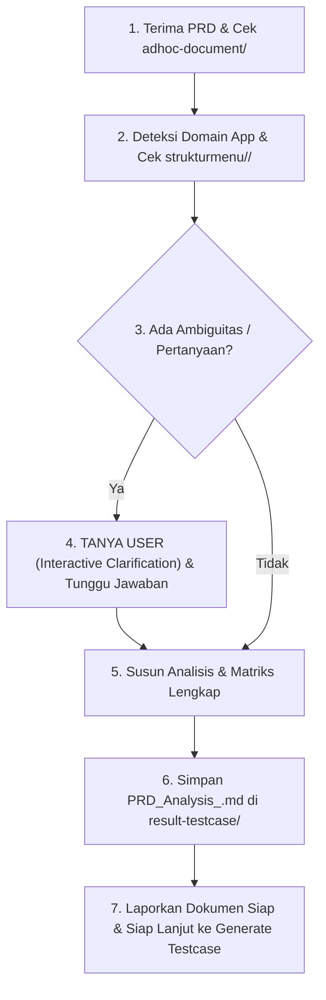

# PRD & Requirement Analysis Skill (`prd-qa-analyzer`)

Skill ini digunakan untuk melakukan **Analisis PRD Mendalam, Ekstraksi Requirement, Pemetaan Hak Akses (RBAC), Integrasi Pengetahuan UI (`strukturmenu/`), Integrasi Dokumen Ad-hoc (`adhoc-document/`), dan Penyusunan Test Matrix Terstruktur** sebelum test case dibuat.

Tujuan utama: Menghasilkan dokumen analisis yang **tajam, akurat, ringkas (tidak bertele-tele), mudah dipahami tim (Product, Dev, QA), menjadi dokumen evidence analysis yang layak bagi tim development, dan strictly in-scope (tanpa asumsi liar atau skenario redundan)**.

---

## 1. Direktori & Lokasi Berkas (*File Architecture*)

- **Dokumen PRD Input**: Terletak di root workspace (misal: `/Users/eldofadlyady/Documents/eldoTest/[PB & PRD] Feature_Name.docx` atau `.md`). User/Agent wajib menyertakan path spesifik file PRD saat menjalankan skill.
- **Support & Knowledge Base**: `/Users/eldofadlyady/Documents/eldoTest/Testcase-support/`
  - Berisi `[SSOT] Requirement for RBAC Customer Dashboard.xlsx`, template acuan, dan knowledge tambahan lainnya.
- **UI Structure Knowledge**: `/Users/eldofadlyady/Documents/eldoTest/strukturmenu/<app-name>/`
  - Terbagi dalam sub-folder per domain aplikasi (misal: `customer-dashboard/`, `dashboard-crm/`, `chatroom-web/`, dll.) yang menjadi acuan nyata tata letak menu, field, dan CTA navigasi.
- **Ad-hoc & Technical Documents (Tentative)**: `/Users/eldofadlyady/Documents/eldoTest/adhoc-document/`
  - Berisi dokumen teknis pendukung tentatif jika tersedia (misal: Swagger/Postman JSON, API contract doc, diagram arsitektur DB/state, catatan meeting rilis, dll.).
- **Target Output Analisis**: `/Users/eldofadlyady/Documents/eldoTest/result-testcase/PRD_Analysis_<Feature_Name>.md`

---

## 2. Prinsip Utama Analisis QA

1. **Interactive Clarification & Strict No-Assumption Policy**:
   - **Tanya Sebelum Menulis**: Jika ada aturan bisnis, rumus kalkulasi/pricing, batasan kuota, status lifecycle yang ambigu, response error code yang belum terdefinisi, atau domain app yang belum pasti di PRD, **Agent WAJIB mengajukan pertanyaan klarifikasi terstruktur kepada User terlebih dahulu**.
   - **Dilarang keras berasumsi liar** (*No wild guesses*). Pembuatan dokumen analisis final hanya dilakukan setelah ambiguitas terjawab atau disepakati mekanismenya.
2. **Explicit Domain & UI Structure Resolution (`strukturmenu/<app-name>/`)**:
   - Identifikasi domain aplikasi target dari PRD (misal: *Customer Dashboard*, *Dashboard CRM*, atau *Chatroom Web*).
   - Periksa ketersediaan folder & screenshot di `strukturmenu/<app-name>/`.
   - Jika domain belum jelas atau folder UI belum ada/belum lengkap, **tanyakan langsung ke user** untuk memastikan letak menu & penamaan CTA.
   - Pemanfaatan knowledge UI difokuskan sebagai acuan pembentukan **Action Steps, Preconditions, dan Assertions** yang detail dan akurat pada tahap pembuatan test case berikutnya.
3. **Ad-hoc Document Inspection (`adhoc-document/`)**:
   - Cek apakah folder `/Users/eldofadlyady/Documents/eldoTest/adhoc-document/` memiliki file pendukung untuk fitur yang sedang dianalisis.
   - Jika ada, manfaatkan untuk memperdalam analisis teknis (API error handling, payload boundaries, flow sequence). Jika kosong, lanjutkan berbasis PRD dan konfirmasi user.
4. **SSOT RBAC & Access Matrix Mapping (`Testcase-support/`)**:
   - Periksa dokumen RBAC pada `Testcase-support/` (misal: `[SSOT] Requirement for RBAC Customer Dashboard.xlsx`).
   - Petakan matriks akses per role vs modul/aksi secara tegas. Role yang tidak memiliki izin dianggap **Forbidden / Hidden / Disabled CTA**.
5. **Zero-Redundancy & Anti Over-Context Principle**:
   - **Fokus Ketat pada Scope**: Bedakan secara tegas antara **In-Scope** vs **Out-of-Scope**.
   - **Pemisahan Pengujian RBAC vs Fungsional**: Pengujian otorisasi dipetakan via tabel matriks ringkas, bukan mengulang seluruh skenario fungsional untuk setiap role.
   - **Boundary & Decision Matrix yang Padat**: Gunakan Decision Table dan Boundary Value Analysis (BVA) untuk logika kompleks.

---

## 3. Metodologi Pengujian & Skala Prioritas

### A. Testing Methods
- **Decision Table Testing (DT)**: Kombinasi kondisi aturan bisnis multi-variabel.
- **State Transition Testing (ST)**: Siklus perubahan status entitas/data (misal: `Draft` ➔ `Active` ➔ `Completed` / `Failed`).
- **Boundary Value Analysis (BVA)**: Pengujian batas minimum, maksimum, batas kuota, dan nilai ekstrem.
- **Equivalence Partitioning (EP)**: Pengelompokan input kelas valid vs invalid.
- **Access Control & RBAC Testing (AC)**: Pengujian otorisasi menu, direct URL, dan tindakan mutasi data per role.
- **Negative & Failure Recovery Testing (NEG)**: Penanganan error validasi, respons gagal dari API/provider eksternal, rollback data, dan timeout.

### B. Priority Matrix
- **P1 (Critical / Blocker)**: Alur transaksi keuangan/kredit/mutasi data penting, integrasi inti, penegakan limit/kuota, integritas rollback data, dan pencegahan bypass keamanan.
- **P2 (High)**: Validasi RBAC per role, kalkulasi data/biaya real-time, filter, pagination, validasi input wajib, dan ekspor data.
- **P3 (Medium / Low)**: Format estetika UI/UX, urutan tampilan (sorting), audit trail/log sekunder, dan tooltip.

---

## 4. Struktur Standar Dokumen Hasil Analisis (Evidence-Grade Document)

Dokumen analisis wajib disimpan di path `result-testcase/PRD_Analysis_<Feature_Name>.md` dengan struktur standar berikut:

```markdown
# Analisis PRD & Perancangan Test Matrix: [Nama Fitur]

## 1. Ringkasan Fitur & Scope Guardrails
- **Tujuan Fitur**: Penjelasan 1-2 paragraf mengenai value bisnis & fungsionalitas utama.
- **Domain Aplikasi Target**: [Nama App, misal: Customer Dashboard / Dashboard CRM / Chatroom Web].
- **Referensi Struktur UI**: [Sebutkan subfolder/file di `strukturmenu/<app-name>/` yang relevan].
- **In-Scope**: Modul/fitur/flow spesifik yang diuji pada iterasi ini.
- **Out-of-Scope**: Fitur di luar cakupan yang tidak terdampak/tidak diuji pada iterasi ini.

## 2. Prasyarat Sistem & Konfigurasi Lingkungan (Pre-requisites)
- Prasyarat akun, subscription tier, environment flag, data master awal, atau hak akses wajib.

## 3. Matriks Hak Akses (RBAC Matrix)
- Tabel ringkas pemetaan Role Pengguna vs Modul/Sub-menu/Aksi (View, Create, Edit, Delete, Export, Toggle).

## 4. Logika Bisnis, Aturan Validasi & Decision Matrix
- **Decision Table / BVA Matrix**: Tabel kondisi logika bisnis, rumus, dan validasi limit.
- **State Transition Flow**: Siklus lifecycle perubahan status (jika fitur berbasis status flow).

## 5. Integrasi Teknis, Penanganan Kegagalan & Edge Cases (Technical & Error Handling)
- **Error Handling & Validations**: Validasi field, batas format, pesan toast error.
- **API & Third-Party Integration**: Penanganan kegagalan provider eksternal, network timeout, rate limit, dan mekanisme rollback.
- **Database & Data Integrity Impact**: Integritas data saat operasi gagal/batal.

## 6. Dampak Regresi (Impact & Regression Scope)
- Fitur atau modul existing lain yang berpotensi terdampak oleh perubahan ini dan perlu uji regresi.

## 7. Catatan Klarifikasi & Keputusan Produk (Clarification & Alignment Log)
- Rangkuman tanya-jawab dan keputusan final dari poin-poin ambigu yang telah dikonfirmasi ke User/PO/Dev sebelum dokumen ini difinalisasi.
```

---

## 5. Langkah Kerja Bertahap (SOP Analisis PRD)



1. **Terima Input PRD & Eksplorasi Pengetahuan Pendukung**:
   - Baca file PRD yang diberikan oleh user.
   - Cek `Testcase-support/` untuk aturan RBAC dan template.
   - Cek folder `adhoc-document/` jika terdapat dokumen teknis tambahan yang relevan.
2. **Identifikasi Domain Aplikasi & Resolusi UI**:
   - Tentukan domain app target (`customer-dashboard`, `dashboard-crm`, `chatroom-web`, dll.).
   - Pelajari layout & komponen di `strukturmenu/<app-name>/`.
3. **Analisa Kebutuhan & Gate Klarifikasi (Interactive Gate)**:
   - Identifikasi logic gap, aturan bisnis, batas limit, respon error, atau ketidakjelasan UI.
   - **WAJIB BERTANYA KE USER**: Sajikan daftar pertanyaan terstruktur dan tunggu respon user sebelum melanjutkan penulisan dokumen.
4. **Penyusunan Analisis Lengkap**:
   - Setelah jawaban diterima, susun analisis menyeluruh sesuai template standar pada Bagian 4.
5. **Simpan Dokumen Hasil Analisis**:
   - Simpan dokumen ke: `/Users/eldofadlyady/Documents/eldoTest/result-testcase/PRD_Analysis_<Feature_Name>.md`.
6. **Lapor & Handover**:
   - Informasikan ke user bahwa dokumen analisis sudah siap dan terverifikasi untuk menjadi acuan pembuatan Test Case (`generate-testcase`).

