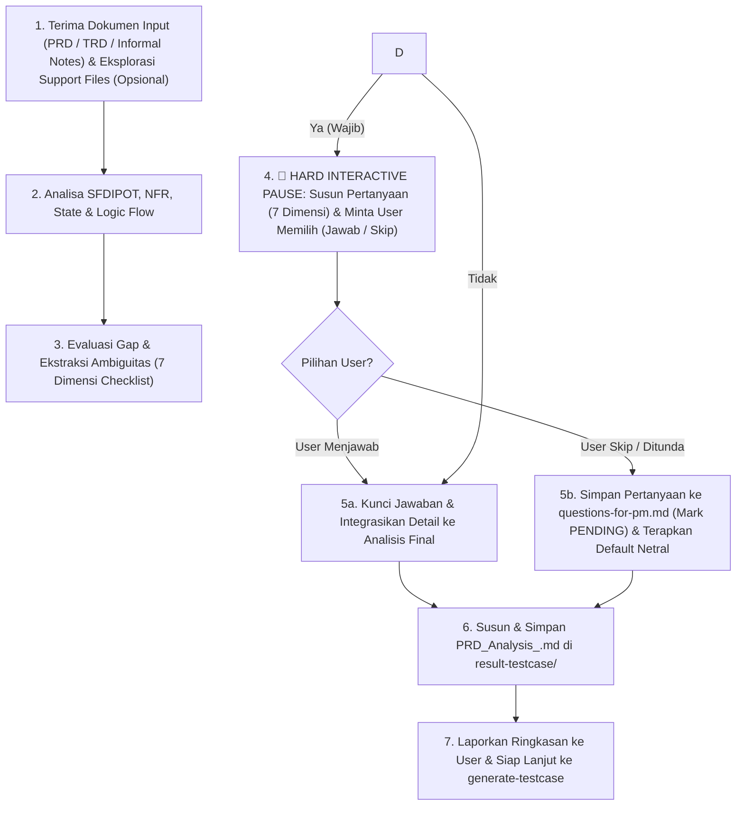

# Universal PRD & Requirement Analysis Skill (`prd-qa-analyzer`)

Skill ini dirancang sebagai standar baku **Senior QA & Quality Architect** untuk melakukan **Analisis PRD/TRD Mendalam, Ekstraksi Requirement Multi-Dimensi (Functional & NFR), Pemodelan State & Decision Matrix, Pemetaan Hak Akses (RBAC/ABAC), dan Penegakan Gerbang Klarifikasi Terstruktur dengan Living PM Questions Management** sebelum test case dibuat.

Tujuan utama: Menghasilkan dokumen analisis yang **tajam, zero-assumption, akurat, evidence-grade (layak audit & development), memiliki traceability jelas, bebas dari redundansi, dan bersifat Universal/Domain-Agnostic (dapat diterapkan pada Web SPA/SSR, Mobile App Android/iOS, Backend API/Microservices, Event-Driven/Webhooks/Queues, Data Pipelines, hingga IoT)**.

---

## 1. Direktori & Fleksibilitas Masukan Dokumen (*Universal Input Architecture*)

Skill ini menggunakan arsitektur masukan yang dinamis dan modular. **Dokumen pendukung TIDAK bersifat wajib** dan tidak boleh memblokir proses analisis jika tidak tersedia:

- **Dokumen Masukan Utama (*Primary Input Document*)**: Terletak di root atau sub-folder workspace (misal: `./[PRD] Feature_Name.docx`, `.pdf`, `.md`, atau TRD teknis).
- **Berkas Pelengkap & Dokumen Pendukung (*Optional Support Files*)**:
  - `./adhoc-document/`: Berkas pelengkap ad-hoc (OpenAPI/Swagger JSON, Postman Collection, GraphQL Schema, DB DDL/ERD, sequence diagram, atau catatan rilis teknis). *Opsional, digunakan sebagai grounding kontrak teknis jika ada.*
  - `./Testcase-support/`: Dokumen acuan RBAC/Permissions SSOT, template standar, catatan arsitektur, dan `qa-learnings.md` (knowledge dari review sebelumnya). *Opsional.*
  - `./strukturmenu/` atau `./ui-references/<app-name>/`: Tangkapan layar, hierarki navigasi, nama menu, CTA, atau link desain (Figma/Wireframes). *Opsional, hanya jika aplikasi memiliki antarmuka pengguna.*
- **Target Output Analisis (2 Berkas Terpisah)**:
  1. **Dokumen Analisis Komprehensif**: `./result-testcase/PRD_Analysis_<Feature_Name>.md`
  2. **Living Questions for PM File**: `./result-testcase/questions-for-pm-<feature_name>.md`

### 4 Profil Masukan Dokumen (*Input Intake Profiles*):
1. **Profil 1 — Standalone Business PRD (Word / PDF / Markdown)**: Dokumen bisnis murni tanpa TRD. Analisis berfokus pada *User Stories*, *Business Rules*, *Acceptance Criteria*, dan *User Experience/Flow*.
2. **Profil 2 — Standalone Technical TRD / Reliability Fix**: Dokumen teknis murni tanpa PRD (misal perbaikan reliabilitas, optimasi database, refactoring backend). Framing dialihkan dari User Persona ke **System Actors** (*Cron Scheduler, Queue Consumer, Upstream Service, Database Engine*) tanpa memaksakan alur menu fiktif.
3. **Profil 3 — Paired Multi-Docs (PRD + TRD + Adhoc Specs)**: Dokumen bisnis didampingi spesifikasi teknis di `./adhoc-document/`. Skill mengeksekusi *Cross-Document Triangulation* untuk memverifikasi apakah arsitektur di TRD sudah 100% meng-cover business rules di PRD (*Contract & Business Drift Check*).
4. **Profil 4 — Informal / Adhoc Context Notes**: Memo tertulis singkat, rangkuman chat developer, atau requirement tidak formal. Agent merekonstruksi requirement baseline secara terstruktur, memetakan risiko, dan memvalidasinya ke user melalui gerbang klarifikasi.

---

## 2. Prinsip Utama Analisis QA (Senior QA Heuristics)

### 1. 📖 EXHAUSTIVE DOCUMENT INGESTION & ZERO-OMISSION DISSECTION (Bedah Dokumen Menyeluruh)
- **Mandatory End-to-End Traversal**: Agent **WAJIB** membaca dan memetakan dokumen sumber dari baris awal hingga baris terakhir secara mendalam. Dilarang keras melakukan *skimming* atau melompat langsung ke sintesis konseptual tingkat tinggi.
- **Total Extraction of Explicit & Implicit Scenarios**:
  - Setiap tabel data, matriks transisi status, diagram alur, sampel skenario pengujian, atau aturan kalkulasi yang tercantum di dalam dokumen input **WAJIB diekstrak 100% ke dalam dokumen analisis**.
  - Agent **TIDAK PERLU TERPATOK** apakah di dokumen awal sudah ada skenario test case formal atau belum; Agent wajib membaca konteks dan mengekstrak seluruh skenario eksplisit maupun implisit yang terkandung di dalam teks menjadi calon skenario pengujian.
- **Proactive Combinatorial Extension**: Setelah seluruh skenario dasar terpetakan, Agent wajib mengembangkan (*extend*) skenario tersebut secara proaktif ke kondisi batas (*boundary*), fluktuasi *in-transit*, *out-of-order events*, *race conditions*, dan skenario kegagalan (*resilience/debt*).
- **Strict Information Preservation (Anti-Loss Policy)**: Setiap perbaikan atau update analisis harus memperkaya dan memperkuat dokumen. **DILARANG MENGURANGI INFORMASI** yang sudah ada tanpa persetujuan eksplisit dari User disertai alasan yang objektif.

### 2. 🛑 STRICT NO-ASSUMPTION & MANDATORY INTERACTIVE CLARIFICATION GATE (Wajib Berhenti & Bertanya)
- **Zero-Wild-Guess Policy**: Agent **DILARANG KERAS** mengasumsikan sendiri aturan bisnis yang belum lengkap, rumus kalkulasi/pricing yang ambigu, batas limit kuota/timeout yang tidak tertulis, penanganan error code yang kosong, perilaku sistem saat kondisi offline/kegagalan, **MENGARANG PATH URL/SCHEMA ENDPOINT API** jika tidak ada OpenAPI/TRD resmi di `./adhoc-document/` (wajib menggunakan narasi pendekatan fungsional yang netral), atau **MENGARANG POHON HIERARKI MENU UI** yang tidak terdapat pada teks PRD atau tangkapan layar `./strukturmenu/`.
- **Hard Interactive Pause (Wajib Berhenti di Chat Sebelum Mengambil Keputusan)**:
  - Sebelum menulis dokumen analisis final, jika terdapat informasi yang masih **abu-abu / belum lengkap / ambigu**, Agent **DILARANG MENGAMBIL KEPUTUSAN SENDIRI** atau langsung men-generate dokumen final dengan asumsi sepihak.
  - Agent **WAJIB BERHENTI DI CHAT**, memaparkan daftar pertanyaan terstruktur kepada User, dan meminta User memilih:
    1. *User Menjawab di Chat*: Informasi langsung dikunci dan diintegrasikan ke dokumen analisis final untuk memperdalam akurasi (*Phase 2 Deep Dive*).
    2. *User Memilih Skip / Menunda / Belum Ada Data*: Seluruh pertanyaan terbuka tersebut dicatat ke berkas terpisah `./result-testcase/questions-for-pm-<feature>.md`, ditandai `[PENDING PM CLARIFICATION]`, dan analisis menerapkan **Standar Nilai Default Netral** (UI menggunakan modul fungsional `[Nama Modul - Role]`, API menggunakan narasi kontrak fungsional `[Service/Contract] <Service>...`).
- **Strict Grep-Before-Answer Communication**: Saat menjawab konfirmasi atau menyebutkan ID Test Case, nomor baris, atau nama tabel di dalam chat, Agent **WAJIB melakukan pencarian eksak (`grep_search` / `view_file`) ke file fisik terlebih dahulu** untuk mencegah halusinasi kode ID.
- **Menu & UI Navigation Grounding (`./strukturmenu/`)**:
  - Periksa teks PRD dan tangkapan layar di `./strukturmenu/` (jika tersedia) untuk memverifikasi apakah suatu menu, tombol CTA, atau modal dialog **benar-benar ada**.
  - Tentukan alur navigasi klik yang nyata (contoh: Klik Menu A $\rightarrow$ Klik Submenu B $\rightarrow$ Klik CTA C).
  - Untuk modul internal/backend tanpa screen capture di `./strukturmenu/` dan tanpa mockup di PRD (misal portal internal Biz Ops Admin), sebutkan modul fungsional PRD secara netral (misal `[Credit Management - Admin]`) tanpa mengarang alur menu fiktif.
- **7 Dimensi Checklist Klarifikasi Wajib**:
  1. *Business Logic & Formula Invariants*: Rumus eksak kalkulasi, pembulatan desimal, currency conversion, kondisi diskon/tiering.
  2. *Scope Guardrails*: Batasan tegas apa yang **In-Scope** vs **Out-of-Scope** pada iterasi ini.
  3. *Role & Authorization Boundaries*: Izin aksi per role (View, Create, Edit, Delete, Export, Approve, Direct API/URL access).
  4. *Error Response & Failure Fallbacks*: Apa yang terjadi saat provider pihak ketiga down, network timeout 504, saldo habis, atau request gagal?
  5. *Data Lifecycle & Invariants*: Siklus hidup entitas (Draft $\rightarrow$ Active $\rightarrow$ Inactive $\rightarrow$ Soft-deleted), kebijakan retensi data, dan PII masking.
  6. *Concurrency & Idempotency*: Pencegahan transaksi ganda akibat double-click CTA atau retry network.
  7. *Platform & Environment Constraints*: Versi OS/browser minimum, device compatibility, throttling network, token expiry duration.

### 3. 🌐 UNIVERSAL MULTI-PLATFORM & DOMAIN-SPECIFIC ADAPTER
Analisis menyesuaikan karakteristik arsitektur target secara dinamis:
- **Web Applications (SPA / SSR)**: Evaluasi browser history, multiple tabs sync, cookie/session management, responsive layout, reload page state, keyboard navigation.
- **Mobile Applications (iOS / Android / Flutter / React Native)**: Evaluasi app lifecycle (background/kill/resume), permission requests (Camera, GPS, Storage), push notification payload, biometrics (FaceID/Fingerprint), offline local storage (SQLite/Hive) sync.
- **Backend APIs & Microservices (REST / GraphQL / gRPC)**: Evaluasi HTTP Status Code (2xx, 4xx, 5xx), request-response JSON contract schema, headers (Authorization, X-Request-ID, Idempotency-Key), rate limiting (429), payload validation, BOLA/IDOR vulnerability.
- **Event-Driven & Asynchronous Systems (Webhooks / Message Broker / Kafka / RabbitMQ / NSQ / SNS-SQS)**: Evaluasi message delivery guarantee (at-least-once), retry policy & exponential backoff, dead-letter queue (DLQ), payload deduplication, out-of-order event handling, clock drift & buffer window.
- **Modular Domain Add-ons**:
  - *Domain AI & Agentic UX*: Preview Sandboxing (Read-only vs State-Mutating POST execution blocking), Dynamic Auto-locking Tool Dependencies, Non-deterministic Fallbacks (Timeout, Token Exhaustion, Repeated Intent).
  - *Domain Fintech / Payment Gateway*: Fee deduction timing (pre-deduct vs post-settlement), 3x24h SLA settlement calculation, multi-state async callback reconciliation (Unpaid $\rightarrow$ Paid $\rightarrow$ Settled/Expired/Failed).
  - *Delta & Cutover Migration*: Analisis data *in-flight/in-transit* saat deployment untuk mencegah *data loss* atau ketidakkonsistenan state.

### 4. 🧠 SFDIPOT HEURISTIC REQUIREMENT MODELING
Gunakan kerangka berpikir SFDIPOT (James Bach HTSM) untuk membedah setiap requirement secara holistik:
- **Structure**: Struktur kode, dependensi library, konfigurasi environment flag.
- **Function**: Seluruh fungsionalitas input-proses-output yang dilakukan oleh sistem.
- **Data**: Karakteristik data input/output, boundary values, tipe data, enkripsi, dan mutasi DB.
- **Interfaces**: UI components, REST endpoints, webhooks, file import/export (CSV, Excel, PDF).
- **Platform**: Platform eksekusi, OS, web browser, hardware limit, network bandwidth.
- **Operations**: Pola penggunaan user nyata, variasi persona, volume beban harian.
- **Time**: Asinkronus, delay timeout, masa kedaluwarsa token/OTP, timezone UTC vs Local time.

### 5. 🔒 NON-FUNCTIONAL REQUIREMENTS (NFR) & ANTI-REDUNDANCY GUARDRAILS
- **Idempotency & Concurrency**: Memastikan request mutasi kritis (pembayaran, pengurangan kuota, pembuatan data) aman dari eksekusi ganda melalui *Distributed Lock* dan *Unique Reference Key*.
- **State Invariants**: Entitas tidak boleh melompati status yang dilarang (misal: dari `Rejected` tidak boleh langsung menjadi `Completed`).
- **Security & OWASP Guardrails**: Pengecekan otorisasi di level API/Object (mencegah manipulasi `user_id` pada URL/payload), sanitasi input (XSS/SQLi), dan perlindungan data pribadi (PII).
- **Graceful Degradation**: Sistem tetap menampilkan feedback informatif (fallback message) saat dependensi eksternal gagal merespons.
- **Zero Redundancy Rule**: Setiap bab dokumen analisis harus menyajikan data yang terfokus tanpa menduplikasi teks yang sama di beberapa section.

---

## 3. Metodologi Pengujian & Skala Prioritas Industri

### A. Testing Methods
- **Decision Table Testing (DT)**: Pemetaan seluruh kombinasi logika multi-variabel.
- **State Transition Testing (ST)**: Pemodelan siklus hidup status data beserta transisi valid vs invalid.
- **Boundary Value Analysis (BVA)**: Pengujian nilai batas (Min-1, Min, Normal, Max, Max+1, Extreme Values).
- **Equivalence Partitioning (EP)**: Pembagian kelas input valid vs invalid.
- **Access Control & RBAC/BOLA Testing (AC)**: Pengujian hak akses per role, direct URL access, dan otorisasi API backend.
- **Negative & Resiliency Testing (RES)**: Penanganan invalid payload, network drop, timeout, dan rollback integritas data.
- **Concurrency & Race Condition Testing (CONC)**: Pengujian klik simultan, multi-user update pada baris data yang sama.
- **Exploratory & Tour Testing (EXP)**: Pengujian heuristik (Saboteur, FedEx, Impatient User).

### B. Priority Matrix Standar Industri
- **P1 (Critical / Blocker)**: Alur transaksi keuangan/kredit, mutasi data inti, penegakan isolasi tenant/data security, rollback integrity, pencegahan bypass auth, dan core happy path.
- **P2 (High)**: Validasi otorisasi RBAC, kalkulasi real-time, filter/sorting/pagination kompleks, boundary data, format input wajib, dan ekspor data.
- **P3 (Medium / Normal)**: Alur sekunder dengan workaround, kesalahan reporting minor, filter lambat.
- **P4 (Low)**: Format visual UI/UX, tooltip, micro-animation, log sekunder, dan pesan error minor.

---

## 4. Struktur Standar Dokumen Hasil Analisis (`result-testcase/PRD_Analysis_<Feature_Name>.md`)

Dokumen analisis wajib memiliki hierarki standar berikut:

```markdown
# Analisis PRD & Perancangan Test Matrix: [Nama Fitur]

## 1. Ringkasan Fitur & Scope Guardrails
- **Tujuan Fitur**: Penjelasan nilai bisnis dan fungsionalitas inti (1-2 paragraf).
- **Arsitektur & Domain Platform**: [Web SPA / Mobile App iOS-Android / Backend API / Event-Driven Microservice].
- **Referensi Interface & Pengetahuan Pendukung**: [Path UI di ./strukturmenu/, Spesifikasi di ./adhoc-document/, atau "Non-UI / Backend-Only Flow" jika murni servis latar belakang].
- **In-Scope**: Modul, alur, dan batasan fungsional yang secara tegas diuji pada iterasi ini.
- **Out-of-Scope**: Fitur/modul di luar cakupan yang tidak terdampak atau ditunda pada rilis ini.

## 2. Prasyarat Sistem & Konfigurasi Lingkungan (Pre-requisites)
- Konfigurasi environment flag, akun uji, role permissions, master data awal, dependency service, atau token autentikasi.

## 3. Matriks Hak Akses & Otorisasi Keamanan (RBAC & Authorization Matrix)
- Tabel pemetaan Role Pengguna vs Modul/Endpoint/Aksi (View, Create, Edit, Delete, Export, Approve, Direct API).
- Penegakan proteksi BOLA/IDOR di layer API backend.

## 4. Pemodelan Logika Bisnis, State Transition & Decision Matrix
- **Decision Table / BVA Matrix**: Tabel kombinasi logika bisnis multi-kondisi beserta expected action.
- **State Transition Flow & Invariants**: Diagram/tabel siklus hidup status entitas (termasuk transisi yang dilarang).

## 5. Non-Functional Requirements, Integrasi Teknis & Error Handling
- **Idempotency & Concurrency Guardrails**: Mekanisme penanganan double-submit dan simultaneous update.
- **API & Third-Party Integration Resiliency**: Timeout threshold, fallback responses, circuit breaker, retry policy.
- **Validation & Sanitization**: Validasi format field, batas ukuran file, sanitasi XSS/SQLi.
- **Data Persistence & Rollback Impact**: Integritas data DB saat transaksi dibatalkan atau gagal di tengah jalan.
- **In-Flight Data & Cutover Invariants (jika ada migrasi/refactor)**: Penanganan data in-transit saat rilis.

## 6. Requirements Traceability Matrix (RTM)
| User Story / Section | Acceptance Criteria (AC) | Target Modul / Area Pengujian | Target Prioritas | Testing Method |
| :--- | :--- | :--- | :---: | :---: |
| US-01 | AC1, AC2 | [Modul Target] | P1 | Decision Table, BVA |

## 7. Dampak Regresi (Impact & Regression Scope)
- Fitur existing, modul upstream/downstream, dan database schema yang berpotensi terdampak oleh perubahan ini.

## 8. Catatan Klarifikasi & Keputusan Produk (Clarification & Alignment Log)
- Rangkuman pertanyaan terstruktur yang telah diajukan ke User beserta keputusan final yang telah disepakati (merujuk ke file questions-for-pm).
```

---

## 5. Format Berkas Living Questions for PM (`result-testcase/questions-for-pm-<feature>.md`)

```markdown
# Questions for Product Manager (PM): [Nama Fitur]

> Dokumen ini berisi daftar pertanyaan klarifikasi terkait aturan bisnis, validasi, toleransi SLA, dan edge case yang belum tercantum secara eksplisit pada dokumen input.
> Mohon diisi pada kolom **Answer** sebelum proses perancangan test case difinalisasi.

| # | Related AC / Section | Question & Context | Impact if Unresolved | Status | Answer |
|---|---|---|---|---|---|
| Q-01 | AC-01 / Section 3.1 | [Pertanyaan spesifik] | [Dampak jika tidak dijawab] | Open | [Jawaban PM] |
| Q-02 | AC-02 / Formula Pricing | [Pertanyaan spesifik] | [Dampak jika tidak dijawab] | Open | [Jawaban PM] |
```

---

## 6. Langkah Kerja Bertahap (SOP Analisis PRD)


```mermaid
graph TD
    A["1. Terima Dokumen Input (PRD / TRD / Informal Notes) & Eksplorasi Support Files (Opsional)"] --> B["2. Analisa SFDIPOT, NFR, State & Logic Flow"]
    B --> C["3. Evaluasi Gap & Ekstraksi Ambiguitas (7 Dimensi Checklist)"]
    D -- "Ya (Wajib)" --> E["4. 🛑 HARD INTERACTIVE PAUSE: Susun Pertanyaan (7 Dimensi) & Minta User Memilih (Jawab / Skip)"]
    E --> F{"Pilihan User?"}
    F -- "User Menjawab" --> G["5a. Kunci Jawaban & Integrasikan Detail ke Analisis Final"]
    F -- "User Skip / Ditunda" --> H["5b. Simpan Pertanyaan ke questions-for-pm.md (Mark PENDING) & Terapkan Default Netral"]
    D -- "Tidak" --> G
    G --> I["6. Susun & Simpan PRD_Analysis_<Feature_Name>.md di result-testcase/"]
    H --> I
    I --> J["7. Laporkan Ringkasan ke User & Siap Lanjut ke generate-testcase"]
```

1. **Eksplorasi Input & Konteks Pendukung**:
   - Baca dokumen utama (PRD / TRD / Catatan informal) dari awal hingga akhir (*end-to-end traversal*).
   - Periksa `./Testcase-support/`, `./adhoc-document/`, dan `./strukturmenu/` jika tersedia (bersifat opsional/pelengkap).
2. **Bedah Kebutuhan secara Mendalam (SFDIPOT & NFR Analysis)**:
   - Identifikasi alur logika bisnis, state lifecycle, rumus, batasan limit, integrasi pihak ketiga, dan potensi celah keamanan.
3. **Ekstraksi Ambiguitas & Evaluasi Gap**:
   - Identifikasi seluruh area abu-abu, batasan limit yang belum didefinisikan, atau fallback error yang belum tertulis.
4. **🛑 Hard Interactive Clarification Pause (Gerbang Klarifikasi 7 Dimensi)**:
   - **Susun daftar pertanyaan yang mencakup 7 Dimensi Checklist Klarifikasi Wajib**: 1) *Business Logic & Formula*, 2) *Scope Guardrails*, 3) *Role & Authorization*, 4) *Error Response & Fallbacks*, 5) *Data Lifecycle & Invariants*, 6) *Concurrency & Idempotency*, 7) *Platform Constraints*.
   - **WAJIB BERHENTI DI CHAT**. Tampilkan daftar pertanyaan terstruktur tersebut kepada User dan minta User memilih apakah ingin menjawab sekarang di chat atau menyimpannya sebagai living questions.
5. **Penyusunan & Penyimpanan Dokumen Analisis Final**:
   - Susun dokumen analisis komprehensif mengikuti Bagian 4 dan simpan ke: `./result-testcase/PRD_Analysis_<Feature_Name>.md`.
   - Simpan berkas living questions (jika ada pertanyaan yang di-skip) ke: `./result-testcase/questions-for-pm-<feature_name>.md`.
6. **Laporan & Handover**:
   - Laporkan ringkasan temuan kritis dan informasikan bahwa dokumen siap diturunkan ke skill `generate-testcase`.

---

## 7. Protokol Anti-Regresi & Pencegahan Konflik Aturan (Universal Guardrail)

> [!CAUTION]
> **PRINSIP KEKEBALAN DAN KONSISTENSI SKILL (ANTI-REGRESSION POLICY):**
> 1. **Dilarang Mengubah/Menghapus Rule Tanpa Persetujuan**: Seluruh aturan fundamental yang sudah stabil pada skill ini **TIDAK BOLEH diubah, diganti, atau dihapus sepihak oleh AI**, kecuali penambahan aturan baru tersebut terbukti objektif lebih baik dan telah disetujui oleh User.
> 2. **Pre-Calibration Sanity & Conflict Check**: Setiap pembaruan atau penambahan aturan baru harus dipastikan **TIDAK BERTENTANGAN** dengan guardrail fundamental (*Zero-Wild-Guess Policy*, grounding visual `./strukturmenu/`, *Living PM Questions Management*, *Hard Interactive Clarification Pause*). Aturan baru harus bersifat memperketat / melengkapi (*additive/enriching*), bukan membatalkan aturan dasar.
