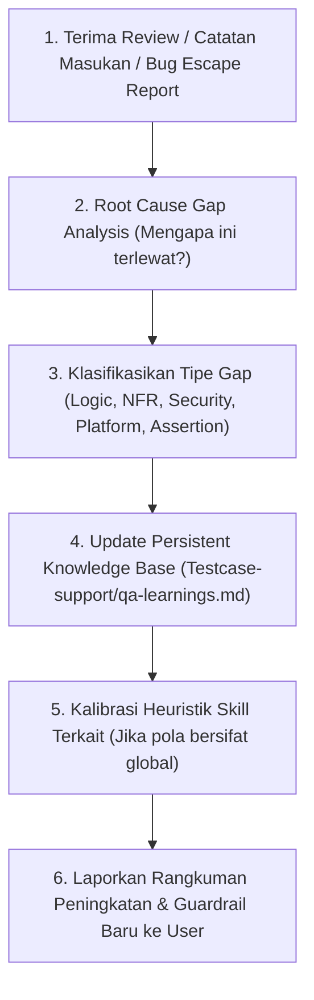

# Continuous QA Learning & Review Skill (`qa-review-learning`)

Skill ini digunakan untuk menjalankan **Mekanisme Continuous Learning & Retrospective Review Loop**. Setiap kali tim (User, Product Manager, Tech Lead, atau QA Lead) memberikan catatan review, masukan walkthrough, atau laporan *bug escape* (bug yang lolos ke staging/production), skill ini akan mengevaluasi penyebabnya (*root cause*), mencatatnya ke knowledge base, dan menyempurnakan heuristik pengujian agar sistem semakin cerdas dan tajam di masa depan.

---

## 1. Direktori & Lokasi Berkas

- **Persistent QA Knowledge Base**: `./Testcase-support/qa-learnings.md`
- **Target Skills yang Dikalibrasi**:
  - SOP Analisis PRD: `.agents/skills/prd-qa-analyzer/SKILL.md`
  - SOP Test Case: `.agents/skills/generate-testcase/SKILL.md`
  - SOP Konversi Dokumen: `.agents/skills/convert-document/SKILL.md`
- **Input Review**:
  - Tabel `Feedbacks & Review Log` pada dokumen analisis atau pesan langsung dari user.

---

## 2. Alur Kerja Continuous Learning Loop



---

## 3. Langkah Kerja Bertahap (SOP Review & Learning)

### Langkah 1: Intake & Ekstraksi Feedback
Identifikasi poin-poin masukan dari reviewer:
- *Apakah ada aturan bisnis baru yang belum tercakup?*
- *Apakah ada edge case / race condition yang sempat luput?*
- *Apakah ada verifikasi layer DB atau API yang kurang spesifik?*
- *Apakah ada terminology UI yang tidak sinkron dengan tampilan rilis?*

### Langkah 2: Analisis Akar Masalah (Root Cause Gap Analysis)
Kelompokkan temuan ke dalam salah satu kategori:
1. **Business Logic Gap**: Kurang tajam saat clarification gate awal.
2. **NFR & Systemic Gap**: Terlewat pada aspek concurrency, network timeout, atau idempotency.
3. **Boundary & Data Gap**: Nilai ekstrem, format karakter khusus, atau floating point precision belum teruji.
4. **Security & RBAC Gap**: Celah otorisasi direct API / object-level permission.
5. **Assertion Gap**: Expected result terlalu dangkal (hanya cek UI tanpa cek DB/Network).

### Langkah 3: Pencatatan ke `Testcase-support/qa-learnings.md`
Tambahkan entri log terstruktur ke `./Testcase-support/qa-learnings.md`:

```markdown
### [YYYY-MM-DD] - [Nama Fitur / Domain]: [Judul Temuan]
- **Kategori Gap**: [Business Logic / NFR / Boundary / Security / Assertion]
- **Temuan / Feedback**: Penjelasan detail apa yang sempat terlewat atau dikoreksi oleh reviewer.
- **Root Cause**: Mengapa hal tersebut bisa terlewat pada analisis awal.
- **Action Item & Guardrail Baru**:
  - Aturan baru yang wajib dicek pada analisis PRD berikutnya.
  - Skenario pengujian standar yang harus ditambahkan ke template test case.
```

### Langkah 4: Kalibrasi Heuristik Skill (Self-Improvement)
Jika temuan tersebut merupakan pola umum yang berlaku untuk banyak aplikasi:
- Perbarui daftar checklist pada `prd-qa-analyzer/SKILL.md` (misal: menambahkan poin validasi baru pada 7 Dimensi Checklist Klarifikasi).
- Perbarui kategori pengujian pada `generate-testcase/SKILL.md` (misal: menambahkan variasi baru pada Exploratory Charters atau Edge Cases).

### Langkah 5: Laporkan Hasil Peningkatan ke User
Sajikan ringkasan singkat kepada user mengenai apa yang telah dipelajari dan bagaimana sistem telah ditingkatkan agar tidak mengulang celah yang sama.
