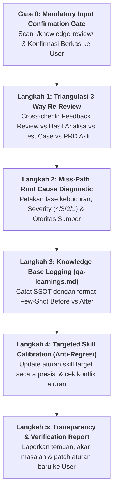

# Continuous QA Learning & Retrospective Review Skill (`qa-review-learning`)

Skill ini digunakan untuk menjalankan **Mekanisme Continuous Learning, Retrospective Review Loop, & Targeted Skill Calibration**. Setiap kali tim (User, Product Manager, Tech Lead, atau QA Lead) memberikan catatan review walkthrough, berkas feedback di folder `./knowledge-review/`, atau laporan *bug escape*, skill ini akan melakukan evaluasi menyeluruh (3-Way Triangulation), mendiagnosis *miss-path* penyebab kebocoran pengujian, mencatatnya ke knowledge base dengan pola komparasi *Before vs After*, dan menyempurnakan heuristik skill QA terkait secara presisi di bawah **Protokol Anti-Regresi Universal**.

---

## 1. Direktori & Lokasi Berkas Dinamis

- **Review & Feedback Intake Folder (Drop-Box)**: `./knowledge-review/`
  - Berisi berkas masukan review dalam format Excel (`.xlsx`, `.csv`), Markdown (`.md`), Word (`.docx`), atau teks (`.txt`).
  - Template acuan:
    - Spreadsheet: `./knowledge-review/TEMPLATE_Review_Feedback_Sample.xlsx`
    - Narasi Markdown: `./knowledge-review/TEMPLATE_Review_Feedback_Sample.md`
- **Persistent QA Knowledge Base (SSOT)**: `./Testcase-support/qa-learnings.md`
- **Target Skills yang Dikalibrasi**:
  - SOP Analisis PRD QA: `.agents/skills/prd-qa-analyzer/SKILL.md`
  - SOP Analisis PRD Bisnis: `.agents/skills/prd-analyzer-business/SKILL.md`
  - SOP Master Test Case Suite: `.agents/skills/generate-testcase/SKILL.md`
  - SOP Konversi Dokumen & Calculation: `.agents/skills/convert-with-calculation/SKILL.md` & `.agents/skills/convert-document/SKILL.md`
- **Dokumen Input Triangulasi**:
  - Dokumen Hasil Analisis PRD (`result-testcase/PRD_Analysis_*.md`)
  - Dokumen Test Case Suite (`result-testcase/Testcase_Suite_*` atau `result-testcase/Test_Cases_*.xlsx`)
  - Dokumen Pendukung Asli (PRD Asli `.docx`/`.pdf`, folder `./strukturmenu/`, `./adhoc-document/`, API Spec, Diagram Arsitektur)

---

## 2. Alur Kerja Continuous Learning Loop


```mermaid
graph TD
    A["<b>Gate 0: Mandatory Input Confirmation Gate</b><br/>Scan ./knowledge-review/ & Konfirmasi Berkas ke User"] --> B["<b>Langkah 1: Triangulasi 3-Way Re-Review</b><br/>Cross-check: Feedback Review vs Hasil Analisa vs Test Case vs PRD Asli"]
    B --> C["<b>Langkah 2: Miss-Path Root Cause Diagnostic</b><br/>Petakan fase kebocoran, Severity (4/3/2/1) & Otoritas Sumber"]
    C --> D["<b>Langkah 3: Knowledge Base Logging (qa-learnings.md)</b><br/>Catat SSOT dengan format Few-Shot Before vs After"]
    D --> E["<b>Langkah 4: Targeted Skill Calibration (Anti-Regresi)</b><br/>Update aturan skill target secara presisi & cek konflik aturan"]
    E --> F["<b>Langkah 5: Transparency & Verification Report</b><br/>Laporkan temuan, akar masalah & patch aturan baru ke User"]
```

---

## 3. Langkah Kerja Bertahap (SOP Review & Learning)

### Gate 0: Mandatory Input Confirmation Gate (Anti-Asumsi & Verifikasi Input)
> [!IMPORTANT]
> **DILARANG melakukan review secara sembarangan atau berasumsi tanpa konfirmasi data!**
> Sebelum memulai analisa review, agen **WAJIB memvalidasi variabel dan dokumen input** kepada user:
> 1. **Pindai Folder `./knowledge-review/`**: Periksa apakah ada berkas review baru (Excel/Markdown/Word). Tanyakan dan konfirmasi ke user apakah berkas tersebut yang menjadi acuan review.
> 2. **Dokumen Hasil Analisis**: Pastikan path/nama berkas analisis PRD yang ditinjau (misal: `result-testcase/PRD_Analysis_<Fitur>.md`).
> 3. **Dokumen Test Case**: Pastikan berkas test case yang diuji (misal: `result-testcase/Test_Cases_<Fitur>.xlsx` / `.md`).
> 4. **Dokumen Pendukung Asli**: Pastikan dokumen acuan awal yang digunakan (PRD `.docx`/`.pdf`, folder visual `./strukturmenu/`, atau API contract di `./adhoc-document/`).
> 5. **Konteks & Catatan Masukan**: Pastikan sumber catatan review (hasil sprint walkthrough, catatan PM/Tech Lead, atau bug escape staging/production).
>
> *Jika salah satu variabel belum teridentifikasi dengan jelas, tanyakan dan konfirmasi terlebih dahulu ke user sebelum melanjutkan.*

---

### Langkah 1: Triangulasi 3-Way Re-Review (Cross-Verification)
Lakukan evaluasi silang tiga arah secara komprehensif antara **Catatan Review (`./knowledge-review/`)** terhadap seluruh dokumen artefak:

1. **Re-Review Hasil Analisis (PRD Analysis Doc)**:
   - Apakah ada aturan bisnis, batasan kuota, formula kalkulasi, atau invariant state yang belum tertangkap?
   - Apakah dimensi SFDIPOT, Decision Table, atau Business Risk Consequence Chain memiliki *blind spot*?
   - Apakah tabel pertanyaan klarifikasi (`Open Questions`) melewatkan asumsi yang berisiko?
2. **Re-Review Test Case Suite (Test Cases Doc & Excel)**:
   - Apakah skenario Happy Path, Boundary Edge Cases, dan Exploratory Charters mencakup kondisi yang dikoreksi?
   - Apakah Boundary Value Analysis (BVA 3-value) diterapkan pada limit yang dipermasalahkan?
   - Apakah Assertion telah menerapkan *Triple-Layer* (UI state, API Contract payload, dan DB Persistence)?
3. **Re-Review Dokumen Pendukung (Supporting Documents)**:
   - Bandingkan dengan PRD asli: Apakah ada terminologi atau alur bisnis yang ambigu di PRD tetapi tidak diklarifikasi?
   - Bandingkan dengan `./strukturmenu/`: Apakah navigasi menu, button trigger, atau modal pop-up sudah ter-grounding dengan tangkapan layar nyata?
   - Bandingkan dengan `./adhoc-document/`: Apakah ada detail OpenAPI atau DB DDL yang terlewatkan?

---

### Langkah 2: Miss-Path Root Cause Diagnostic & Feedback Authority Weighting

#### A. Matriks Otoritas & Pembobotan Sumber Feedback

| Sumber Feedback (*Source*) | Domain Otoritas Utama | Tingkat Severity & Bobot | Target Skill yang Dikalibrasi |
| :--- | :--- | :--- | :--- |
| **Product Manager (PM) / Business Owner** | Scope fitur, logika bisnis, aturan kuota/pricing, user flow, terminologi bisnis | **HIGH (Weight 3) - CRITICAL (Weight 4)** | `prd-analyzer-business`<br/>• Clarification Checklist<br/>• Business Risk Chains |
| **Tech Lead / Backend / Architect** | API contract, DB persistence, konsistensi data, concurrency, idempotency, NFR, error code | **HIGH (Weight 3) - CRITICAL (Weight 4)** | `prd-qa-analyzer` & `generate-testcase`<br/>• Triple-Layer Assertions<br/>• Narasi kontrak API/DB |
| **QA Lead / Senior QA Reviewer** | Test coverage, boundary value (BVA), exploratory charters, negative test scenarios | **MEDIUM (Weight 2) - HIGH (Weight 3)** | `generate-testcase`<br/>• Adversarial Edge Cases<br/>• Standar BVA 3-Value depth |
| **Bug Escape (Incident Staging / Prod)** | Kebocoran bug nyata yang lolos ke staging/production | **CRITICAL (Weight 4)** *(Mandatory RCA)* | **Semua Skill Terkait**<br/>• Wajib 5-Whys RCA<br/>• Tambah Anti-Miss Guardrail permanen |

#### B. Skala Pembobotan Severity (4 / 3 / 2 / 1)
- **CRITICAL (Weight 4)**: Kerugian finansial langsung, celah keamanan/RBAC bypass, korupsi data, sistem crash/down.
- **HIGH (Weight 3)**: Alur transaksi utama terblokir, perhitungan biaya/limit salah, desinkronisasi status antar service.
- **MEDIUM (Weight 2)**: Skenario edge-case terlewat, boundary limit tidak diuji 3 titik, pesan error ambigu.
- **LOW (Weight 1)**: Typo label, inkonsistensi format penomoran ID, perapian minor format dokumen.

#### C. Pemetaan Fase Miss-Path (5-Whys Framework)
| Fase Miss Path | Karakteristik Masalah | Contoh Akar Masalah |
| :--- | :--- | :--- |
| **Phase 1: PRD Intake & Grounding** | Halusinasi UI / Mengarang menu fiktif / Salah kutip teks PRD | Tidak membaca `./strukturmenu/` atau melewatkan catatan kaki dokumen PRD. |
| **Phase 2: Clarification Gate** | Asumsi sepihak tanpa bertanya ke PM | Menemukan formula ambigu tetapi langsung berasumsi tanpa mencatatnya di tabel Open Questions. |
| **Phase 3: Deep Modeling & Heuristic** | Blind spot pada Concurrency, State Transition, atau NFR | Model SFDIPOT tidak mengeksplorasi kondisi koneksi terputus, timeout, idempotency, atau RBAC. |
| **Phase 4: Test Case Generation** | Assertion dangkal atau skenario pengujian bolong | Hanya memvalidasi respon UI tanpa memverifikasi field payload API atau tabel database. |

---

### Langkah 3: Pencatatan ke Persistent Knowledge Base (`qa-learnings.md`)

Catat entri pembelajaran terstruktur ke `./Testcase-support/qa-learnings.md` menggunakan pola **Few-Shot Before vs After**:

```markdown
### [YYYY-MM-DD] - [Nama Modul / Fitur]: [Judul Temuan / Feedback]
- **Target Dokumen yang Ditinjau**:
  - Berkas Feedback: `knowledge-review/<nama-file>`
  - Hasil Analisa: `result-testcase/PRD_Analysis_<Fitur>.md`
  - Test Case: `result-testcase/Test_Cases_<Fitur>.xlsx`
  - Dokumen Pendukung: PRD Asli & `./strukturmenu/`
- **Sumber Feedback & Severity**: [PM / Tech Lead / QA Lead / Bug Escape] | [CRITICAL (Weight 4) / HIGH (Weight 3) / MEDIUM (Weight 2) / LOW (Weight 1)]
- **Fase Miss Path**: [Phase 1: Intake / Phase 2: Clarification / Phase 3: Modeling / Phase 4: Test Suite]
- **Kategori Gap**: [Business Logic / NFR & Concurrency / Boundary & Data / Security & RBAC / Assertion / UI Grounding]

---
🔴 KONDISI SEBELUMNYA (BEFORE / MISS PATH):
[Jika Miss Testcase: Tuliskan 'KOSONG / TIDAK ADA TEST CASE' beserta alasan mengapa terlewat]
[Jika Flawed Testcase: Tuliskan kutipan step / assertion lama yang dangkal atau mengarang]

---
🟢 KONDISI HASIL PEMBELAJARAN (AFTER / CALIBRATED RESULT):
[Tuliskan skenario test case ideal dengan ID, Precondition, Steps, dan Triple-Layer Assertions (UI + API/Contract + DB Persistence)]

---
🛡️ GUARDRAIL & HEURISTIK BARU:
- Aturan / checklist baru yang wajib dipatuhi pada proses berikutnya.
- Target Skill yang Dikalibrasi: [`prd-qa-analyzer`, `generate-testcase`, dll.]
```

---

### Langkah 4: Targeted Skill Calibration & Universal Anti-Regression Protocol

> [!CAUTION]
> **PROTOKOL ANTI-REGRESI & PENCEGAHAN KONFLIK ATURAN (UNIVERSAL GUARDRAIL):**
> 1. **Dilarang Mengubah/Menghapus Rule Tanpa Persetujuan**: Seluruh aturan fundamental yang sudah stabil pada skill (`prd-qa-analyzer`, `prd-analyzer-business`, `generate-testcase`, `convert-document`, `convert-with-calculation`, `qa-review-learning`) **TIDAK BOLEH diubah, diganti, atau dihapus sepihak oleh AI**, kecuali penambahan aturan baru tersebut terbukti objektif lebih baik dan telah disetujui oleh User.
> 2. **Pre-Calibration Sanity & Conflict Check**: Sebelum menyuntikkan aturan baru ke skill target:
>    - Pastikan aturan baru **TIDAK BERTENTANGAN** dengan guardrail fundamental (seperti: *Zero-Wild-Guess Policy*, grounding visual `./strukturmenu/`, penegakan *Triple-Layer Assertions*, dan *Mandatory Clarification Gate*).
>    - Jika terjadi potensi tumpang tindih (*overlap*), aturan baru harus bersifat **memperketat / melengkapi (additive/enriching)**, bukan membatalkan aturan dasar.
> 3. **Pemberlakuan Universal**: Protokol ini berlaku mengikat di seluruh berkas `.agents/skills/*/SKILL.md`.

#### Panduan Kalibrasi ke Skill Target:
1. **Update ke `prd-qa-analyzer/SKILL.md` atau `prd-analyzer-business/SKILL.md`**:
   - Tambahkan item spesifik pada *Clarification Checklist* atau *SFDIPOT Heuristic*.
   - Perketat aturan *UI Navigation Grounding* berbasis `./strukturmenu/`.
   - Tambahkan *guardrail* mitigasi resiko pada tabel dampak bisnis.
2. **Update ke `generate-testcase/SKILL.md`**:
   - Tambahkan pola *Exploratory Charters* atau *Adversarial Edge-Case Candidates*.
   - Perjelas aturan *Triple-Layer Assertion* untuk field atau status transaksi yang rawan desinkronisasi.
3. **Update ke `convert-with-calculation/SKILL.md`**:
   - Sesuaikan bobot kalkulasi resiko jika ada kategori resiko baru yang perlu dimasukkan ke executive scorecard.

---

### Langkah 5: Transparency & Verification Report
Sajikan laporan ringkas dan transparan kepada user yang mencakup:
1. **Rangkuman Evaluasi Triangulasi**: Hasil cross-check berkas review `./knowledge-review/` vs dokumen analisis, test case, dan PRD asli.
2. **Identifikasi Miss Path & Root Cause**: Fase kebocoran, tingkat severity, dan akar masalah (5-Whys).
3. **Pembaruan Knowledge Base**: Konfirmasi penambahan entri log baru di `qa-learnings.md` dengan format Before vs After.
4. **Bukti Kalibrasi Skill**: Rincian aturan baru yang diusulkan / ditambahkan ke skill target sesuai protokol anti-regresi.
