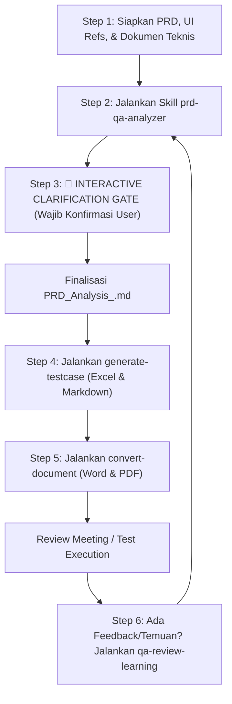

# 🚀 Universal PRD Analyzer & Enterprise QA Test Automation Framework

Repository ini dirancang untuk tim **Quality Assurance (QA), Product Manager (PM), dan Software Engineer (SWE)** guna mempercepat siklus pengujian perangkat lunak di berbagai domain aplikasi (**Web SPA/SSR, Mobile Android/iOS, Backend REST/GraphQL/gRPC APIs, Microservices, Event-Driven/Webhooks, Data Pipelines, hingga IoT**).

Framework ini didukung oleh **Agentic AI Custom Skills** yang mengimplementasikan standar pengujian tingkat lanjut (*Senior QA / Quality Architecture*):
1. **Analisis PRD Mendalam & Penegakan Strict Interactive Validation Gate**: Mengekstraksi requirement bisnis, batasan scope, aturan otorisasi (RBAC/ABAC), state transition invariants, NFR (idempotency, concurrency, resilience), dan security guardrails tanpa asumsi liar.
2. **Pembuatan Master Test Case Suite 3-Tier**: Menghasilkan file Excel berstandar industri (15 kolom terstruktur) dan file Markdown otomasi deklaratif dengan **Triple-Layer Assertions (UI + API Contract + DB State Persistence)** serta **Exploratory Heuristic Charters**.
3. **Ekspor Dokumen Resmi Layak Audit (Word `.docx` / PDF `.pdf`)**: Mengonversi hasil analisis menjadi dokumen berstandar **TIW (Test Idea & Walkthrough)** dengan Traceability Matrix & Quality Gate.
4. **Mekanisme Continuous Learning & Review Loop (`qa-review-learning`)**: Menyerap feedback review sprint / bug escape report dan otomatis memperbarui basis pengetahuan (`Testcase-support/qa-learnings.md`) serta heuristik skill.

---

## 📋 Daftar Isi
- [Persyaratan Sistem & Instalasi](#-persyaratan-sistem--instalasi)
- [Struktur Direktori Workspace](#-struktur-direktori-workspace)
- [Alur Kerja & Panduan Penggunaan Skill (Step-by-Step)](#-alur-kerja--panduan-penggunaan-skill-step-by-step)
  - [Step 1: Persiapan Dokumen & Input Awal](#step-1-persiapan-dokumen--input-awal)
  - [Step 2: Menjalankan Analisis PRD (`prd-qa-analyzer`)](#step-2-menjalankan-analisis-prd-prd-qa-analyzer)
  - [Step 3: Gerbang Klarifikasi Terstruktur (Interactive Gate)](#step-3-gerbang-klarifikasi-terstruktur-interactive-gate---wajib)
  - [Step 4: Menghasilkan Test Cases Suite (`generate-testcase`)](#step-4-menghasilkan-test-cases-suite-generate-testcase)
  - [Step 5: Ekspor ke Word / PDF (`convert-document`)](#step-5-ekspor-ke-word--pdf-convert-document)
  - [Step 6: Continuous Learning & Review Feedback (`qa-review-learning`)](#step-6-continuous-learning--review-feedback-qa-review-learning)
- [Ringkasan Custom Agent Skills](#-ringkasan-custom-agent-skills)
- [3-Tier Test Coverage Matrix & Triple-Layer Assertions](#-3-tier-test-coverage-matrix--triple-layer-assertions)

---

## 💻 Persyaratan Sistem & Instalasi

### 1. Kebutuhan Dasar
- **Python**: Versi `3.9` atau lebih baru (`python3 --version`).
- **Google Antigravity (AGY)** IDE / CLI environment.

### 2. Instalasi Paket Python yang Diperlukan
Jalankan perintah berikut pada terminal di root direktori project:

```bash
pip3 install python-docx reportlab openpyxl markdown pillow typing-extensions
```

---

## 🗂️ Struktur Direktori Workspace

```text
├── .agents/skills/                       # Custom AI Agent Skills
│   ├── prd-qa-analyzer/                  # SOP Analisis PRD, SFDIPOT, NFR & Interactive Gate
│   ├── generate-testcase/                # SOP Master Test Case (Excel 15-Kolom & Markdown Otomasi)
│   ├── convert-document/                 # SOP Konversi Dokumen ke DOCX & PDF berstandar TIW
│   │   └── scripts/
│   │       ├── md_to_docx.py             # Script converter Word dinamis
│   │       └── md_to_pdf.py              # Script converter PDF dinamis
│   └── qa-review-learning/               # SOP Continuous Learning & Retrospective Review Loop
│
├── Testcase-support/                     # Knowledge Base & SSOT Templates
│   ├── qa-learnings.md                   # SSOT Catatan Pembelajaran & Pola Edge Cases Baru
│   ├── [SSOT] Requirement for RBAC.xlsx # Matriks Hak Akses Pengguna
│   ├── Test_Cases_Meta_New_Pricing_2026.xlsx  # Template Master Excel 15 Kolom
│   └── quick-reply-crud.md               # Template Markdown Otomasi
│
├── strukturmenu/                         # Referensi UI & Screenshot Menu Aplikasi (Modular)
├── adhoc-document/                       # Dokumen Teknis Ad-hoc (OpenAPI, Postman, DB Schema)
├── result-testcase/                      # Folder Output Utama (MD, DOCX, PDF, XLSX)
└── README.md
```

---

## 🔄 Alur Kerja & Panduan Penggunaan Skill (Step-by-Step)



---

### Step 1: Persiapan Dokumen & Input Awal
Letakkan dokumen PRD (`.docx`, `.pdf`, atau `.md`) di dalam workspace, serta lengkapi dokumen teknis di `adhoc-document/` atau referensi UI di `strukturmenu/` jika tersedia.

---

### Step 2: Menjalankan Analisis PRD (`prd-qa-analyzer`)
Minta agent menganalisis dokumen PRD:
> *"Tolong lakukan analisis PRD untuk file `[PRD] Nama_Fitur.docx` menggunakan skill `prd-qa-analyzer`."*

---

### Step 3: Gerbang Klarifikasi Terstruktur (*Interactive Gate* - Wajib)
> [!IMPORTANT]
> Agent **DILARANG KERAS** berasumsi sendiri. Agent akan berhenti dan menyajikan pertanyaan terstruktur seputar 7 Dimensi (*Logic, Scope, RBAC, Error Fallbacks, Data Lifecycle, Idempotency, Platform*). Berikan jawaban/keputusan bisnis sebelum agent menyusun dokumen final `result-testcase/PRD_Analysis_<Nama_Fitur>.md`.

---

### Step 4: Menghasilkan Test Cases Suite (`generate-testcase`)
Setelah dokumen analisis disetujui, minta agent menyusun test case:
> *"Analisis PRD sudah disetujui. Tolong buatkan Master Test Case lengkap (Excel & Markdown) menggunakan skill `generate-testcase`."*

Output yang dihasilkan:
1. `result-testcase/Test_Cases_<Nama_Fitur>.xlsx` (Master Spreadsheet 15 Kolom).
2. `result-testcase/test-cases-<nama-fitur>.md` (Automation-ready dengan Triple-Layer Assertions & Exploratory Charters).

---

### Step 5: Ekspor ke Word / PDF (`convert-document`)
Untuk keperluan pelaporan resmi walkthrough ke manajemen / tim dev:
> *"Tolong konversikan dokumen `result-testcase/PRD_Analysis_<Nama_Fitur>.md` ke format Word dan PDF menggunakan skill `convert-document`."*

---

### Step 6: Continuous Learning & Review Feedback (`qa-review-learning`)
Jika ada revisi, masukan dari meeting TIW, atau temuan bug baru di staging/production:
> *"Tolong review masukan berikut menggunakan skill `qa-review-learning`: [Tuliskan feedback / bug report]. Perbarui knowledge base dan tingkatkan heuristik pengujian kita."*

Agent akan menganalisis *root cause gap*, mencatat pelajaran ke `Testcase-support/qa-learnings.md`, dan mengalibrasi SOP skill.

---

## 🛠️ Ringkasan Custom Agent Skills

| Skill Name | Lokasi | Trigger Prompt Utama |
| :--- | :--- | :--- |
| **`prd-qa-analyzer`** | [`.agents/skills/prd-qa-analyzer/`](.agents/skills/prd-qa-analyzer/SKILL.md) | *"Analisis PRD ini...", "Review requirement fitur..."* |
| **`generate-testcase`** | [`.agents/skills/generate-testcase/`](.agents/skills/generate-testcase/SKILL.md) | *"Generate test case dari hasil analisa...", "Buat test suite Excel..."* |
| **`convert-document`** | [`.agents/skills/convert-document/`](.agents/skills/convert-document/SKILL.md) | *"Convert dokumen md ke docx/pdf...", "Ekspor hasil analisa ke Word..."* |
| **`qa-review-learning`** | [`.agents/skills/qa-review-learning/`](.agents/skills/qa-review-learning/SKILL.md) | *"Review hasil testing ini...", "Tingkatkan skill berdasarkan feedback..."* |

---

## 📐 3-Tier Test Coverage Matrix & Triple-Layer Assertions

```
┌────────────────────────────────────────────────────────────────────────┐
│                        3-TIER TEST COVERAGE MATRIX                     │
├────────────────────────────────────────────────────────────────────────┤
│  TIER 1: HAPPY PATH (Golden Business Journey)                          │
│  - Nominal end-to-end user journeys & authorized standard flows        │
├────────────────────────────────────────────────────────────────────────┤
│  TIER 2: BOUNDARY, SYSTEMIC & SECURITY EDGE CASES                      │
│  - Data Boundaries (Min/Max, Precision, UTF-8/Emoji)                   │
│  - Concurrency & Idempotency (Double-clicks, simultaneous updates)     │
│  - Network & Fallbacks (3G throttling, 504 Timeout, offline sync)      │
│  - Security & RBAC (Direct URL, IDOR/BOLA tampering, expired tokens)   │
├────────────────────────────────────────────────────────────────────────┤
│  TIER 3: EXPLORATORY TESTING CHARTERS (Heuristic Tours)                │
│  - The FedEx Tour, The Saboteur/Chaos, The Rushed User, The Rogue Tour │
└────────────────────────────────────────────────────────────────────────┘
```

**Triple-Layer Assertions**:
- **Layer 1 (UI/Client State)**: Button states, loading indicators, toast messages, modal lifecycle, badges.
- **Layer 2 (API/Network Contract)**: HTTP Status Code (2xx/4xx/5xx), payload schema, response time SLA.
- **Layer 3 (DB/Data Persistence)**: Data mutation in tables, UTC timestamps, audit trail logs, event queue triggers.
