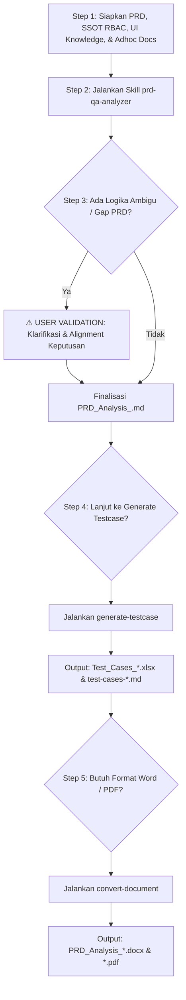

# 🚀 PRD Analyzer & QA Test Suite Automation Framework

Repository ini dirancang untuk tim **Quality Assurance (QA), Product Manager (PM), dan Software Engineer (SWE)** guna mempercepat proses:
1. **Analisis PRD Mendalam & Penegakan Guardrails**: Mengekstraksi requirement bisnis, batasan kuota/pricing, dan matriks hak akses pengguna (RBAC).
2. **Pembuatan Master Test Case Suite Lengkap**: Menghasilkan file Excel berstandar industri (15 kolom terstruktur) dan file Markdown bernomor (*Action $\rightarrow$ Assertion*) yang siap dibaca oleh framework otomatisasi testing.
3. **Ekspor Dokumen Resmi (Word `.docx` / PDF `.pdf`)**: Mengonversi hasil analisis menjadi dokumen berstandar **Everpro TIW (Test Idea & Walkthrough)**.

---

## 📋 Daftar Isi
- [Persyaratan Sistem & Instalasi](#-persyaratan-sistem--instalasi)
- [Struktur Direktori Workspace](#-struktur-direktori-workspace)
- [Alur Kerja & Panduan Penggunaan Skill (Step-by-Step)](#-alur-kerja--panduan-penggunaan-skill-step-by-step)
  - [Step 1: Persiapan Data & Input Awal](#step-1-persiapan-data--input-awal-pre-requisites)
  - [Step 2: Menjalankan Skill Analisis PRD (`prd-qa-analyzer`)](#step-2-menjalankan-skill-analisis-prd-prd-qa-analyzer)
  - [Step 3: Gerbang Validasi User & Konfirmasi Ambiguitas (Wajib)](#step-3-gerbang-validasi-user--konfirmasi-ambiguitas-wajib)
  - [Step 4: Menghasilkan Test Cases Suite (`generate-testcase`)](#step-4-menghasilkan-test-cases-suite-generate-testcase)
  - [Step 5: Mengonversi Hasil ke Word / PDF (`convert-document`)](#step-5-mengonversi-hasil-ke-word--pdf-convert-document)
- [Ringkasan Custom Agent Skills](#-ringkasan-custom-agent-skills)
- [Troubleshooting & FAQ](#-troubleshooting--faq)

---

## 💻 Persyaratan Sistem & Instalasi

Sebelum menggunakan repository ini, pastikan sistem Anda memenuhi dependensi berikut:

### 1. Kebutuhan Dasar
- **Python**: Versi `3.9` atau lebih baru (`python3 --version`).
- **Google Antigravity (AGY)** IDE / CLI environment.

### 2. Instalasi Paket Python yang Diperlukan
Jalankan perintah berikut pada terminal di root direktori project:

```bash
pip3 install python-docx reportlab openpyxl markdown pillow typing-extensions
```

> [!NOTE]
> - `python-docx` digunakan untuk membaca dan membuat dokumen Word (`.docx`).
> - `reportlab` dan `pillow` digunakan untuk membuat dokumen PDF (`.pdf`).
> - `openpyxl` digunakan untuk menyusun Master Test Case Excel (`.xlsx`) dengan styling 15 kolom.

---

## 🗂️ Struktur Direktori Workspace

```text
├── .agents/skills/                       # Custom AI Agent Skills
│   ├── prd-qa-analyzer/                  # Skill SOP Analisis PRD & Decision Matrix
│   ├── generate-testcase/                # Skill Pembuat Master Test Case (Excel & MD)
│   └── convert-document/                 # Skill Konversi Dokumen ke DOCX & PDF
│       └── scripts/
│           ├── md_to_docx.py             # Script converter Word
│           └── md_to_pdf.py              # Script converter PDF
│
├── Testcase-support/                     # Knowledge Base & SSOT Template
│   ├── [SSOT] Requirement for RBAC Customer Dashboard.xlsx  # SSOT Hak Akses
│   ├── [TIW] Everpro Chat Reborn - Webhook OpenAPI.docx     # Template Dokumen Acuan TIW
│   ├── Test_Cases_Meta_New_Pricing_2026.xlsx                # Template Master Excel 15 Kolom
│   └── quick-reply-crud.md                                  # Template Markdown Otomasi
│
├── strukturmenu/                         # Knowledge Base UI & Screenshot Menu Aplikasi
│   ├── chatroom-web/                     # Tampilan UI Chatroom Web
│   ├── customer-dashboard/               # Tampilan UI Customer Dashboard
│   └── dashboard-crm/                    # Tampilan UI Dashboard CRM
│
├── adhoc-document/                       # Dokumen Teknis Ad-hoc (Swagger, API Contract, DB Specs)
├── result-testcase/                      # Folder Output Utama (MD, DOCX, PDF, XLSX)
├── [PB & PRD] *.docx                     # Berkas PRD Input dari Product Team
└── README.md
```

---

## 🔄 Alur Kerja & Panduan Penggunaan Skill (Step-by-Step)



---

### Step 1: Persiapan Data & Input Awal (*Pre-requisites*)

Sebelum meminta AI menganalisis fitur, pastikan data-data berikut telah diletakkan pada folder yang sesuai:

1. **File PRD**: Letakkan dokumen PRD (`.docx`, `.pdf`, atau `.md`) di root workspace.
2. **Dokumen RBAC**: Pastikan file SSOT RBAC tersedia di `Testcase-support/[SSOT] Requirement for RBAC Customer Dashboard.xlsx`.
3. **Screenshot UI (`strukturmenu/`)**:
   - Masukkan screenshot menu/tombol/field baru ke sub-folder terkait:
     - `strukturmenu/dashboard-crm/` untuk CRM / Merchant admin.
     - `strukturmenu/chatroom-web/` untuk Chatroom agen/CS.
     - `strukturmenu/customer-dashboard/` untuk Dashboard pelanggan.
4. **Dokumen Teknis Ad-hoc (`adhoc-document/`)** *(Opsional)*:
   - Jika ada spesifikasi API contract / Swagger JSON / schema DB, letakkan di folder ini.

> [!WARNING]
> **PENTING: Jangan Melewatkan Penyediaan Screenshot UI (`strukturmenu/`)**
> Jika Anda tidak menyediakan referensi UI atau penamaan menu yang jelas, agent tidak dapat menyusun langkah test case (*Action Steps*) dan label tombol (*CTA*) yang akurat sesuai tampilan sistem nyata.

---

### Step 2: Menjalankan Skill Analisis PRD (`prd-qa-analyzer`)

Minta agent untuk membaca dokumen PRD dan memulai proses analisis:

**Contoh Prompt ke Agent:**
> *"Tolong lakukan analisis PRD untuk file `[PB & PRD] Everpro Chat Meta New Pricing 2026.docx` menggunakan skill `prd-qa-analyzer`."*

Agent akan melakukan hal berikut:
1. Membaca seluruh isi PRD dan dokumen pendukung di `adhoc-document/`.
2. Mencocokkan hak akses pengguna dengan SSOT RBAC di `Testcase-support/`.
3. Meninjau tata letak navigasi di `strukturmenu/`.
4. Mengidentifikasi apakah ada celah logika (*business logic gap*), rumus harga, batas limit, atau respon gagal yang belum dijelaskan di PRD.

---

### Step 3: Gerbang Validasi User & Konfirmasi Ambiguitas (Wajib)

> [!CAUTION]
> **TITIK KRITIS: USER HARUS ME-REVIEW & MEMVALIDASI PERTANYAAN AGENT**
> - **DILARANG BERASUMSI**: Jika PRD memiliki ambiguitas, agent **WAJIB** berhenti dan mengajukan daftar pertanyaan klarifikasi terstruktur kepada Anda.
> - **Tanggung Jawab User**: Anda harus meninjau pertanyaan tersebut dan memberikan jawaban/keputusan bisnis yang disepakati bersama tim Product/Dev sebelum dokumen difinalisasi.

Setelah Anda memberikan jawaban konfirmasi:
- Agent akan menyusun dokumen analisis resmi:
  📂 `result-testcase/PRD_Analysis_<Nama_Fitur>.md`
- Dokumen ini berisi: *Scope Guardrails (In/Out-of-Scope), RBAC Matrix, Decision Tables, Boundary Value Analysis (BVA), Integrasi & Error Handling, Regression Scope, dan Clarification Log*.

---

### Step 4: Menghasilkan Test Cases Suite (`generate-testcase`)

Setelah dokumen analisis `PRD_Analysis_<Nama_Fitur>.md` divalidasi dan disetujui, minta agent membuat master test cases:

**Contoh Prompt ke Agent:**
> *"Analisis PRD sudah disetujui. Tolong buatkan Test Case lengkap menggunakan skill `generate-testcase` berbasis dokumen `result-testcase/PRD_Analysis_<Nama_Fitur>.md`."*

Agent akan menghasilkan 2 output secara sekuensial:

1. **Master Test Case Spreadsheet (`.xlsx`)**:
   - Lokasi: `result-testcase/Test_Cases_<Nama_Fitur>.xlsx`
   - Standar 15 kolom: `project_id`, `suite_id`, `unique_id` (format: `<APP>-<MAINMENU>-<SUBMENU>-<SEQ>`), `title`, `decription`, `precondition`, `priority`, `type`, `status`, `tags`, `steps`, `step_desc`, `expected_desc`, `is_automated`, `user_story`.
   - Header berwarna Navy (`#1F4E78`) dengan text wrap dan border rapi.
2. **Automation-Ready Markdown (`.md`)**:
   - Lokasi: `result-testcase/test-cases-<nama-fitur>.md`
   - Berisi langkah deklaratif bernomor (*Action $\rightarrow$ Assertion*) lengkap dengan **Tagging Prioritas & Kompleksitas Otomasi** (misal: `[Auto-Critical][Low-Complexity]`).

> [!WARNING]
> **VALIDASI DISTRIBUSI PRIORITAS (P1 / P2 / P3)**
> Periksa ringkasan distribusi test case yang dilaporkan oleh agent. Pastikan alur transaksi keuangan, isolasi data, limit kuota, dan integritas rollback masuk ke kategori **Critical (P1)**.

---

### Step 5: Mengonversi Hasil ke Word / PDF (`convert-document`)

Untuk keperluan pelaporan resmi kepada tim Product, Engineering Lead, atau QA Walkthrough (TIW), konversikan dokumen hasil analisis `.md` menjadi format **Word (`.docx`)** atau **PDF (`.pdf`)**.

**Contoh Prompt ke Agent:**
> *"Tolong konversikan dokumen `result-testcase/PRD_Analysis_<Nama_Fitur>.md` menjadi file Word (.docx) dan PDF (.pdf) menggunakan skill `convert-document`."*

**Atau Jalankan Manual via Terminal:**
```bash
# 1. Konversi ke Word (.docx)
python3 .agents/skills/convert-document/scripts/md_to_docx.py \
  result-testcase/PRD_Analysis_<Nama_Fitur>.md \
  result-testcase/PRD_Analysis_<Nama_Fitur>.docx

# 2. Konversi ke PDF (.pdf)
python3 .agents/skills/convert-document/scripts/md_to_pdf.py \
  result-testcase/PRD_Analysis_<Nama_Fitur>.md \
  result-testcase/PRD_Analysis_<Nama_Fitur>.pdf
```

Dokumen Word dan PDF yang dihasilkan akan secara otomatis memiliki:
- ✅ **Header Box TIW Standar** (*Feature Name, Supporting Docs, Contributor, Approver, Informed*).
- ✅ **Tabel Changelog & Status Approval**.
- ✅ **Styling Tabel Aksen Cyan (`#00FFFF`)** untuk *Decision Table* dan *Test Scenarios*.
- ✅ **Tabel Feedback Reviewer** untuk mencatat evaluasi meeting.

---

## 🛠️ Ringkasan Custom Agent Skills

| Skill Name | Lokasi | Trigger Prompt Utama |
| :--- | :--- | :--- |
| **`prd-qa-analyzer`** | [`.agents/skills/prd-qa-analyzer/`](.agents/skills/prd-qa-analyzer/SKILL.md) | *"Analisis PRD ini...", "Review requirement fitur..."* |
| **`generate-testcase`** | [`.agents/skills/generate-testcase/`](.agents/skills/generate-testcase/SKILL.md) | *"Generate test case dari hasil analisa...", "Buat test suite Excel..."* |
| **`convert-document`** | [`.agents/skills/convert-document/`](.agents/skills/convert-document/SKILL.md) | *"Convert dokumen md ke docx/pdf...", "Ekspor hasil analisa ke Word..."* |

---

## ❓ Troubleshooting & FAQ

#### 1. Error `ModuleNotFoundError: No module named 'docx'` / `'reportlab'` / `'openpyxl'`
**Solusi**: Pastikan Anda telah menginstal seluruh paket python:
```bash
pip3 install python-docx reportlab openpyxl markdown pillow
```

#### 2. Tabel pada hasil export Word/PDF terpotong
**Solusi**: Periksa apakah ada kolom tabel yang terlalu panjang pada file `.md`. Skrip `md_to_docx.py` dan `md_to_pdf.py` sudah memiliki auto-width adapter, namun jika kolom melebihi 7 kolom, pertimbangkan untuk membaginya menjadi 2 tabel logika terpisah.

#### 3. Apakah nama menu/button di test case bisa berbeda dengan aplikasi nyata?
**Solusi**: Pastikan screenshot di folder `strukturmenu/<app-name>/` selalu diperbarui sesuai mockup Figma atau Staging terbaru sebelum menjalankan skill `generate-testcase`.

---

## 👨‍💻 Kontributor & Tim
- **QA Engineering**: Eldo Fadlyady
- **Platform**: Google Antigravity (AGY) Agentic Framework
- **Organisasi**: Everpro QA Team
