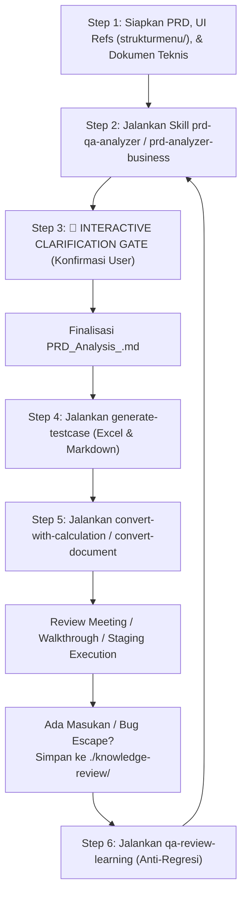

# 🚀 Universal PRD Analyzer & Enterprise QA Test Automation Framework

Repository ini dirancang untuk tim **Quality Assurance (QA), Product Manager (PM), dan Software Engineer (SWE)** guna mempercepat siklus analisis kebutuhan dan pengujian perangkat lunak di berbagai domain aplikasi (**Web SPA/SSR, Mobile Android/iOS, Backend REST/GraphQL/gRPC APIs, Microservices, Event-Driven/Webhooks, Data Pipelines, hingga IoT**).

Framework ini didukung oleh **Agentic AI Custom Skills** yang mengimplementasikan standar pengujian tingkat lanjut (*Senior QA / Quality Architecture*):
1. **Analisis PRD Mendalam & Penegakan Strict Interactive Validation Gate (`prd-qa-analyzer` & `prd-analyzer-business`)**: Mengekstraksi requirement bisnis, batasan scope, pemetaan risiko bisnis multi-pilar (Financial, Ops, Customer, Compliance, Reputational, Support), aturan otorisasi (RBAC/ABAC), state transition invariants, NFR (idempotency, concurrency, resilience), dan security guardrails tanpa asumsi liar.
2. **Pembuatan Master Test Case Suite 3-Tier (`generate-testcase`)**: Menghasilkan file Excel berstandar industri (15 kolom terstruktur) dan file Markdown otomasi deklaratif dengan **Triple-Layer Assertions (UI + API Contract + DB State Persistence)**, **Adversarial Edge-Case Candidates**, serta **Exploratory Heuristic Charters**.
3. **Ekspor Dokumen Resmi Layak Audit (Word `.docx` / PDF `.pdf`) & Weighted Risk Calculation (`convert-document` & `convert-with-calculation`)**: Mengonversi hasil analisis menjadi dokumen berstandar **TIW (Test Idea & Walkthrough)** dengan Traceability Matrix, kalkulasi matematis bobot risiko (4/3/2/1), dan rekomendasi rilis objektif (*Go / Conditional Go / No-Go*).
4. **Mekanisme Continuous Learning & Review Drop-Box (`qa-review-learning`)**: Menyerap masukan sprint walkthrough / laporan bug escape melalui folder `./knowledge-review/` (Excel & Markdown), mencatat SSOT ke `Testcase-support/qa-learnings.md` dengan format *Before vs After*, dan mengalibrasi heuristik skill secara presisi di bawah **Protokol Anti-Regresi Universal**.

---

## 📋 Daftar Isi
- [Persyaratan Sistem & Instalasi](#-persyaratan-sistem--instalasi)
- [Struktur Direktori Workspace](#-struktur-direktori-workspace)
- [Alur Kerja & Panduan Penggunaan Skill (Step-by-Step)](#-alur-kerja--panduan-penggunaan-skill-step-by-step)
  - [Step 1: Persiapan Dokumen & Input Awal](#step-1-persiapan-dokumen--input-awal)
  - [Step 2: Menjalankan Analisis PRD (`prd-qa-analyzer` / `prd-analyzer-business`)](#step-2-menjalankan-analisis-prd-prd-qa-analyzer--prd-analyzer-business)
  - [Step 3: Gerbang Klarifikasi Terstruktur (Interactive Gate)](#step-3-gerbang-klarifikasi-terstruktur-interactive-gate---wajib)
  - [Step 4: Menghasilkan Test Cases Suite (`generate-testcase`)](#step-4-menghasilkan-test-cases-suite-generate-testcase)
  - [Step 5: Ekspor ke Word / PDF dengan Scorecard (`convert-document` / `convert-with-calculation`)](#step-5-ekspor-ke-word--pdf-dengan-scorecard-convert-document--convert-with-calculation)
  - [Step 6: Continuous Learning & Walkthrough Review (`qa-review-learning`)](#step-6-continuous-learning--walkthrough-review-qa-review-learning)
- [Ringkasan Custom Agent Skills](#-ringkasan-custom-agent-skills)
- [Folder `knowledge-review/` & Format Template Review](#-folder-knowledge-review--format-template-review)
- [Protokol Anti-Regresi & Pencegahan Konflik Aturan](#-protokol-anti-regresi--pencegahan-konflik-aturan)
- [3-Tier Test Coverage Matrix & Triple-Layer Assertions](#-3-tier-test-coverage-matrix--triple-layer-assertions)

---

## 💻 Persyaratan Sistem & Instalasi

### 1. Kebutuhan Dasar
- **Python**: Versi `3.9` atau lebih baru (`python3 --version`).
- **Google Antigravity (AGY)** IDE / CLI environment.

### 2. Instalasi Paket Python yang Diperlukan
Jalankan perintah berikut pada terminal di root direktori project:

```bash
pip3 install python-docx reportlab openpyxl markdown pillow typing-extensions
```

---

## 🗂️ Struktur Direktori Workspace

```text
├── .agents/skills/                       # Custom AI Agent Skills
│   ├── prd-qa-analyzer/                  # SOP Analisis PRD, SFDIPOT, NFR & Interactive Gate
│   ├── prd-analyzer-business/            # SOP Analisis PRD Bisnis, 6 Pilar Risiko & Living PM Questions
│   ├── generate-testcase/                # SOP Master Test Case (Excel 15-Kolom & Markdown Otomasi)
│   ├── convert-document/                 # SOP Konversi Dokumen ke DOCX & PDF berstandar TIW
│   ├── convert-with-calculation/         # SOP Konversi TIW dengan Math Engine & Scorecard Release Gate
│   │   └── scripts/
│   │       ├── calc_engine.py            # Quantitative Weighted Risk Math Engine
│   │       ├── md_to_docx.py             # Word Converter dengan Embedded Scorecard
│   │       └── md_to_pdf.py              # PDF Converter dengan Embedded Scorecard
│   └── qa-review-learning/               # SOP Continuous Learning & Walkthrough Review Loop
│
├── knowledge-review/                     # 📥 Drop-Box Folder Masukan Review & Walkthrough
│   ├── TEMPLATE_Review_Feedback_Sample.xlsx # Template Input Review Tabel Excel
│   └── TEMPLATE_Review_Feedback_Sample.md   # Template Input Review Narasi Markdown
│
├── Testcase-support/                     # Knowledge Base & SSOT Templates
│   ├── qa-learnings.md                   # SSOT Catatan Pembelajaran (Few-Shot Before vs After)
│   ├── knowledge basic apps.md           # Knowledge Base Spesifik Fitur & Domain Aplikasi
│   ├── [SSOT] Requirement for RBAC.xlsx # Matriks Hak Akses Pengguna
│   └── Test_Cases_Meta_New_Pricing_2026.xlsx  # Template Master Excel 15 Kolom
│
├── strukturmenu/                         # Referensi UI & Screenshot Menu Aplikasi (Modular Grounding)
├── adhoc-document/                       # Dokumen Teknis Ad-hoc (OpenAPI, Postman, DB Schema)
├── result-testcase/                      # Folder Output Utama (MD, DOCX, PDF, XLSX, Scorecards)
└── README.md
```

---

## 🔄 Alur Kerja & Panduan Penggunaan Skill (Step-by-Step)


```mermaid
graph TD
    A["Step 1: Siapkan PRD, UI Refs (strukturmenu/), & Dokumen Teknis"] --> B["Step 2: Jalankan Skill prd-qa-analyzer / prd-analyzer-business"]
    B --> C["Step 3: 🛑 INTERACTIVE CLARIFICATION GATE (Konfirmasi User)"]
    C --> D["Finalisasi PRD_Analysis_<Feature>.md"]
    D --> E["Step 4: Jalankan generate-testcase (Excel & Markdown)"]
    E --> F["Step 5: Jalankan convert-with-calculation / convert-document"]
    F --> G["Review Meeting / Walkthrough / Staging Execution"]
    G --> H["Ada Masukan / Bug Escape?<br/>Simpan ke ./knowledge-review/"]
    H --> I["Step 6: Jalankan qa-review-learning (Anti-Regresi)"]
    I --> B
```

---

### Step 1: Persiapan Dokumen & Input Awal
Letakkan dokumen PRD (`.docx`, `.pdf`, atau `.md`) di dalam workspace, serta lengkapi dokumen teknis di `adhoc-document/` atau referensi UI di `strukturmenu/` jika tersedia.

---

### Step 2: Menjalankan Analisis PRD (`prd-qa-analyzer` / `prd-analyzer-business`)
Minta agent menganalisis dokumen PRD:
> *"Tolong lakukan analisis PRD untuk file `[PRD] Nama_Fitur.docx` menggunakan skill `prd-qa-analyzer` (atau `prd-analyzer-business`)."*

---

### Step 3: Gerbang Klarifikasi Terstruktur (*Interactive Gate* - Wajib)
> [!IMPORTANT]
> Agent **DILARANG KERAS** berasumsi sendiri (*Zero-Wild-Guess Policy*). Agent akan berhenti dan menyajikan pertanyaan terstruktur seputar 7 Dimensi (*Logic, Scope, RBAC, Error Fallbacks, Data Lifecycle, Idempotency, Platform*). Berikan jawaban/keputusan bisnis sebelum agent menyusun dokumen final `result-testcase/PRD_Analysis_<Nama_Fitur>.md`.

---

### Step 4: Menghasilkan Test Cases Suite (`generate-testcase`)
Setelah dokumen analisis disetujui, minta agent menyusun test case:
> *"Analisis PRD sudah disetujui. Tolong buatkan Master Test Case lengkap (Excel & Markdown) menggunakan skill `generate-testcase`."*

Output yang dihasilkan:
1. `result-testcase/Test_Cases_<Nama_Fitur>.xlsx` (Master Spreadsheet 15 Kolom).
2. `result-testcase/test-cases-<nama-fitur>.md` (Automation-ready dengan Triple-Layer Assertions & Exploratory Charters).

---

### Step 5: Ekspor ke Word / PDF dengan Scorecard (`convert-document` / `convert-with-calculation`)
Untuk keperluan pelaporan resmi walkthrough ke manajemen / tim dev:
> *"Tolong konversikan dokumen `result-testcase/PRD_Analysis_<Nama_Fitur>.md` ke format Word dan PDF dengan scorecard rilis menggunakan skill `convert-with-calculation`."*

---

### Step 6: Continuous Learning & Walkthrough Review (`qa-review-learning`)
Jika ada revisi sprint walkthrough, masukan dari Tech Lead/PM, atau laporan bug escape:
1. Simpan catatan masukan ke folder `./knowledge-review/` (format Excel `.xlsx`/`.csv` atau Markdown `.md`).
2. Panggil skill review:
> *"Tolong review masukan di folder `knowledge-review/` menggunakan skill `qa-review-learning`. Lakukan evaluasi triangulasi, catat pelajaran ke `qa-learnings.md`, dan perbarui aturan skill jika ada gap."*

Agent akan memvalidasi variabel di **Gate 0**, melakukan **Triangulasi 3-Way**, mendiagnosis akar masalah (5-Whys), mencatat pola *Before vs After*, dan mengalibrasi SOP skill di bawah **Protokol Anti-Regresi**.

---

## 🛠️ Ringkasan Custom Agent Skills

| Skill Name | Lokasi | Trigger Prompt Utama |
| :--- | :--- | :--- |
| **`prd-qa-analyzer`** | [`.agents/skills/prd-qa-analyzer/`](.agents/skills/prd-qa-analyzer/SKILL.md) | *"Analisis PRD ini...", "Review requirement teknis..."* |
| **`prd-analyzer-business`** | [`.agents/skills/prd-analyzer-business/`](.agents/skills/prd-analyzer-business/SKILL.md) | *"Analisis PRD dengan dampak bisnis...", "Modelkan konsekuensi risiko..."* |
| **`generate-testcase`** | [`.agents/skills/generate-testcase/`](.agents/skills/generate-testcase/SKILL.md) | *"Generate test case dari hasil analisa...", "Buat test suite Excel 15 kolom..."* |
| **`convert-document`** | [`.agents/skills/convert-document/`](.agents/skills/convert-document/SKILL.md) | *"Convert dokumen md ke docx/pdf standar TIW..."* |
| **`convert-with-calculation`** | [`.agents/skills/convert-with-calculation/`](.agents/skills/convert-with-calculation/SKILL.md) | *"Convert dokumen dengan perhitungan bobot risiko & scorecard Go/No-Go..."* |
| **`qa-review-learning`** | [`.agents/skills/qa-review-learning/`](.agents/skills/qa-review-learning/SKILL.md) | *"Review hasil review walkthrough di knowledge-review/...", "Update skill dari temuan..."* |

---

## 📥 Folder `knowledge-review/` & Format Template Review

Folder `./knowledge-review/` berfungsi sebagai **Drop-Box Review Input**. Pengguna dari berbagai role dapat meletakkan berkas masukan dalam 2 format pilihan:

### 1. Template Tabel Excel (`.xlsx` / `.csv`)
* File acuan: [`TEMPLATE_Review_Feedback_Sample.xlsx`](knowledge-review/TEMPLATE_Review_Feedback_Sample.xlsx)
* Kolom standar: `No` | `Modul / Submodul` | `Uraian Temuan / Missed Case (Gap)` | `Expected Behavior yang Seharusnya (Triple-Layer)` | `Sumber / Reviewer` | `Severity Level` | `Rekomendasi Guardrail / Action Item`

### 2. Template Narasi Markdown (`.md` / `.docx` / `.txt`)
* File acuan: [`TEMPLATE_Review_Feedback_Sample.md`](knowledge-review/TEMPLATE_Review_Feedback_Sample.md)
* Berisi metadata sesi, daftar poin masukan per modul, kondisi expected result, dan lampiran referensi baru.

---

## 🛡️ Protokol Anti-Regresi & Pencegahan Konflik Aturan

Semua skill pada framework ini dilindungi oleh **Universal Anti-Regression Protocol**:
1. **Dilarang Mengubah/Menghapus Rule Tanpa Persetujuan**: Aturan baku yang sudah stabil **TIDAK BOLEH diubah/dihapus sepihak oleh AI**, kecuali pembaruan terbukti lebih baik dan disetujui User.
2. **Pre-Calibration Sanity & Conflict Check**: Setiap aturan baru wajib dicek agar **TIDAK BERTENTANGAN** dengan guardrail fundamental (*Zero-Wild-Guess Policy*, grounding visual `./strukturmenu/`, *Triple-Layer Assertions*, dan *Mandatory Clarification Gate*). Penambahan aturan harus bersifat memperkaya (*additive/enriching*).

---

## 📐 3-Tier Test Coverage Matrix & Triple-Layer Assertions

```
┌────────────────────────────────────────────────────────────────────────┐
│                        3-TIER TEST COVERAGE MATRIX                     │
├────────────────────────────────────────────────────────────────────────┤
│  TIER 1: HAPPY PATH (Golden Business Journey)                          │
│  - Nominal end-to-end user journeys & authorized standard flows        │
├────────────────────────────────────────────────────────────────────────┤
│  TIER 2: BOUNDARY, SYSTEMIC & SECURITY EDGE CASES                      │
│  - Data Boundaries (3-Value BVA: Min-1, Min, Min+1, Max-1, Max, Max+1) │
│  - Concurrency & Idempotency (Rapid double-click, simultaneous updates)│
│  - Network & Fallbacks (3G throttling, 504 Timeout, offline sync)      │
│  - Security & RBAC (Direct URL, IDOR/BOLA tampering, expired tokens)   │
├────────────────────────────────────────────────────────────────────────┤
│  TIER 3: EXPLORATORY TESTING CHARTERS (Heuristic Tours)                │
│  - The FedEx Tour, The Saboteur/Chaos, The Rushed User, The Rogue Tour │
└────────────────────────────────────────────────────────────────────────┘
```

**Triple-Layer Assertions**:
- **Layer 1 (UI/Client State)**: Button states (disabled/loading), toast alert messages, modal lifecycle, badges.
- **Layer 2 (API/Network Contract)**: HTTP Status Code (2xx/4xx/5xx), payload schema, service event emission.
- **Layer 3 (DB/Data Persistence)**: Data mutation in tables, UTC timestamps, audit trail logs, quota deduction rows.
