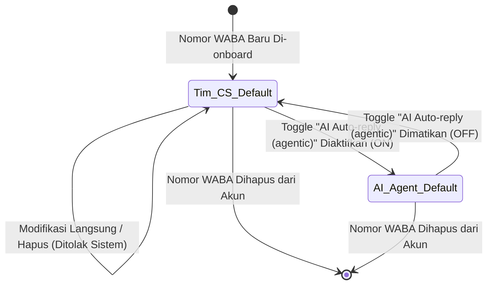

# Analisis PRD & Perancangan Test Matrix: Chat Flow Orchestration Everpro Chat

## 1. Ringkasan Fitur & Scope Guardrails
- **Tujuan Fitur**: Menyediakan orkestrasi perutean percakapan masuk (*inbound chat flow orchestration*) yang fleksibel dan terpadu di Everpro Chat. Fitur ini menyatukan pengaturan automasi chat, integrasi AI Agent (agentic auto-reply), dan tim CS manusia (Human Agent & Divisi) ke dalam antarmuka terpadu (**Pengaturan Alur Chat** & visual builder), memastikan prioritas pemicu pesan (*source over keyword*), handover otomatis yang mulus, serta visualisasi bubble chat yang transparan dan kemampuan pengambilalihan manual (*takeover/turn off flow*) di Chat Room.
- **In-Scope**:
  1. **Menu Pengaturan Alur Chat (Chat Flow)**: Rebranding menu dari "Automasi" ke "Pengaturan Alur Chat", pembaruan kolom tabel daftar alur (*Name, Assigned phone number, Lead source, Keyword source, First responders, Involve human, Status active/inactive*).
  2. **Primary Default Flow & Multi-trigger Logic**: Lifecycle *primary default flow* saat onboarding nomor WABA, override perilaku saat toggle *AI Autoreply (agentic)* diaktifkan/dinonaktifkan, pencegahan duplikasi kombinasi trigger pertama (*Phone Number + Source + Keyword*), evaluasi prioritas trigger (*Source over Keyword*), dan pembentukan otomatis pasangan *default keyword pair* pada flow berkata kunci kustom.
  3. **AI Agent Configuration & Alignment**: Penugasan 1 nomor WABA ke AI Agent, peringatan/proteksi integritas relasi antara menu *AI Agent* dan *Chat Flow*, konfigurasi mandatory *transfer condition* (intent & destination) dan *fallback condition* (undefined intent, AI disruption, credit exhausted, AI repetitive prevention).
  4. **Visual Builder & Handover Integration**: Konfigurasi handover dari kartu *Template* ke kartu AI Agent baru (*inline creation*) maupun AI Agent yang sudah ada (*existing agent*), aktivasi paksa jika target AI Agent *inactive*, serta eksekusi perpindahan konteks percakapan di *runtime*.
  5. **Restrukturisasi Menu Tim CS / Human Agent**: Penataan ulang sub-menu (*Daftar Tim CS, Divisi, Jam kerja, Pengaturan distribusi pesan*), pengalihan konfigurasi distribusi berbasis kata kunci ke *Chat Flow*, migrasi otomatis data distribusi kustom eksisting.
  6. **Chat Room Experience & Takeover**: Visualisasi pembeda bubble chat (*Template, AI Agent, Human Agent, Customer*), penanda identitas pengirim (nama AI Agent / Human Agent), persistensi bubble history, serta tombol dan aksi **Ambil Alih Chat / Turn off flow** untuk menghentikan respon otomatis dan mengalihkan ke penanganan manual CS.
- **Out-of-Scope**:
  - Modifikasi algoritma LLM generatif di backend AI Agent di luar aturan fallback/intent.
  - Fitur penagihan kuota/pembelian kredit AI di luar validasi kondisi *credit exhausted fallback*.
  - Pengujian aplikasi mobile jika fitur Chat Flow visual builder hanya tersedia di Web Dashboard (kecuali Chat Room web view / responsive testing).

---

## 2. Prasyarat Sistem & Konfigurasi Lingkungan (Pre-requisites)
1. **Akun & Akses**: Akun Everpro Chat dengan role **Owner**, **Supervisor**, atau **Agent (CS)** dengan hak akses modul Chat & Pengaturan Alur Chat.
2. **Konektivitas WABA**: Minimal 1 nomor WhatsApp Business API (WABA) aktif terdaftar pada akun.
3. **AI Agent & Kredit**: Tersedia AI Agent aktif/inaktif dan saldo kredit AI untuk pengujian skenario respon normal dan skenario *AI credit exhausted*.
4. **Data Master Organisasi**: Tersedia divisi utama (*primary division*), divisi kustom, serta agen CS untuk pengujian distribusi dan handover.

---

## 3. Matriks Hak Akses (RBAC Matrix)

| Modul / Sub-menu / Aksi | Owner | Supervisor | Agent (CS Closing / Operational) | Admin Gudang / Lainnya |
| :--- | :---: | :---: | :---: | :---: |
| **Buka Menu Pengaturan Alur Chat** | Full Access | Full Access | No Access (Hidden/Forbidden) | No Access |
| **Buat / Edit / Hapus Alur Chat Kustom** | Full Access | Full Access | No Access | No Access |
| **Aktivasi / Deaktivasi Alur Chat** | Full Access | Full Access | No Access | No Access |
| **Konfigurasi AI Agent (Basic, Knowledge, Style, WABA)** | Full Access | Full Access | No Access | No Access |
| **Konfigurasi Transfer & Fallback Condition AI** | Full Access | Full Access | No Access | No Access |
| **Akses Sub-menu Tim CS & Distribusi Pesan** | Full Access | Full Access | View Only / No Access (tergantung divisi) | No Access |
| **Akses Chat Room & Lihat Bubble Chat** | Full Access | Full Access | Full Access (sesuai assignment chat) | No Access |
| **Aksi Ambil Alih Chat (Turn Off Flow)** | Allowed | Allowed | Allowed (pada chat yang ditangani) | No Access |

---

## 4. Logika Bisnis, Aturan Validasi & Decision Matrix

### A. Decision Table: Prioritas Pemicu Pesan Masuk (*Incoming Chat Trigger Evaluation*)
*Aturan Bisnis: Source lebih diprioritaskan dibanding Keyword (Source over Keyword).*

| Kondisi Masuk: Source | Kondisi Masuk: Keyword | Flow Terdaftar yang Cocok | Flow yang Dieksekusi | Alasan / Prioritas |
| :--- | :--- | :--- | :--- | :--- |
| Source = `B` | Keyword = `A` | Flow Y (`Source B, Keyword default`) vs Flow X (`Source default, Keyword A`) | **Flow Y** | Match Source spesifik (`B`) > Match Keyword spesifik (`A`) |
| Source = `C` | Keyword = `D` | Flow Z (`Source C, Keyword D`) vs Flow Z-default (`Source C, Keyword default`) | **Flow Z** | Match Source spesifik (`C`) AND Keyword spesifik (`D`) |
| Source = `C` | Keyword = `E` (tidak terdaftar di kustom) | Flow Z-default (`Source C, Keyword default`) vs Primary Default | **Flow Z-default** | Fallback ke default keyword pair untuk Source `C` |
| Source = `Organic` (Unassigned source) | Keyword = `Promo` | Flow K (`Source default, Keyword Promo`) vs Primary Default | **Flow K** | Source default menangkap semua source, lalu mencocokkan Keyword spesifik |
| Source = `Organic` | Keyword = `Unknown` | Primary Default Flow (Tim CS / AI Agent) | **Primary Default Flow** | Tangkapan akhir seluruh pesan tak bertuan |

### B. Lifecycle & State Transition: Primary Default Flow

### C. Decision Table: Validasi Konfigurasi & Relasi Antar-Modul

| Skenario / Aksi | Kondisi Sistem | Respon Sistem / Validasi |
| :--- | :--- | :--- |
| **Pembuatan Alur Chat Baru** | Nomor Telepon + Source + Keyword sama persis dengan alur yang sudah ada | **Blocked**: Tampilkan error *"flow with Phone number X, source Y, and Keyword Z is already exist"*. |
| **Pembuatan Alur dengan Keyword Kustom** | Flow dibuat dengan Source = `C`, Keyword = `D` | **Auto-create**: Sistem otomatis membuat `[Nama] - default keyword` (Source: `C`, Keyword: `default`, Target: Tim CS Utama). |
| **Hapus / Matikan Keyword Kustom Flow** | Flow induk dihapus atau toggle keyword dimatikan | **Auto-cleanup**: Flow `[Nama] - default keyword` ikut terhapus otomatis. |
| **Nonaktifkan AI Agent di Konfigurasi AI** | AI Agent sedang digunakan dalam Chat Flow aktif | **Warning Confirmation**: Tampilkan *"this AI Agent A is involved in chat flow/automation X, continue?"*. Jika "Yes", AI nonaktif, flow tetap ada. |
| **Aktivasi Chat Flow yang Broken** | Chat Flow merujuk pada AI Agent inaktif / nomor WABA AI telah dicopot | **Blocked**: Cegah aktivasi alur dan tampilkan pesan error integritas yang jelas. |
| **Handover Template ke Existing Inactive AI** | Dipilih AI Agent yang berstatus inaktif pada visual builder | **Confirmation Popup**: Tampilkan *"this action will activate AI Agent A, continue?"*. Jika "Yes", AI otomatis diaktifkan dan flow disimpan. |

### D. Visualisasi Bubble Chat di Chat Room

| Tipe Pengirim | Gaya Visual Bubble | Label / Metadata Pengirim | Interaksi Input CS |
| :--- | :--- | :--- | :--- |
| **Template Automasi** | Bubble style khusus Template | Label "Template" / Nama Template | Read-only / Tampil tombol "Ambil Alih" |
| **AI Agent** | Bubble style khusus AI | Label "AI Agent" + Nama AI Agent | Tampil tombol overlay "Ambil Alih Chat" |
| **Human Agent (CS)** | Bubble style standar CS | Label "Human Agent" + Nama Agen CS | Field input aktif untuk mengetik balasan |
| **Customer** | Bubble standar Customer | Sesuai profil pengirim Customer | Tidak berubah |

---

## 5. Penanganan Kegagalan, Edge Cases & Third-party Integrations

1. **AI Fallback Handover**:
   - Jika intent customer tidak terdefinisi (*undefined intent*), layanan AI mengalami gangguan (*service disruption*), kredit AI habis (*credit exhausted*), atau terdeteksi repetisi jawaban AI (2x respon identik), sistem **wajib langsung melakukan fallback handover** ke tujuan manusia yang dikonfigurasi.
2. **Chat Room Takeover Concurrency**:
   - Saat CS menekan tombol **Ambil Alih Chat / Turn Off Flow**:
     - Status flow pada percakapan tersebut seketika menjadi *off*.
     - Respon otomatis (AI Agent maupun step template berikutnya) dihentikan secara instan.
     - Tombol overlay ambil alih disembunyikan dan input box dibuka untuk CS.
     - Pesan baru dari customer setelah pengambilalihan **tidak boleh memicu alur automasi/AI kembali**.
3. **Data Migration Integrity (Backward Compatibility)**:
   - Data pengaturan distribusi berbasis kata kunci eksisting harus otomatis terkonversi menjadi entitas Chat Flow bernama `CS Custom distribution [n]` (Source: default, Keyword: custom) tanpa kehilangan pemetaan kata kunci dan divisi tujuan.

---

## 6. Daftar Pertanyaan Terbuka & Ambiguitas (Open Questions)

> [!IMPORTANT]
> Berikut adalah poin-poin klarifikasi dan ambiguitas teknis/bisnis yang ditemukan pada PRD untuk dikonfirmasi ke Tim Product / Tech Lead:

1. **Mekanisme Re-assign / Switch-back ke AI Agent**:
   - *Pertanyaan*: Setelah percakapan diambil alih (*Turn off flow / Ambil Alih Chat*) oleh Human Agent, apakah ada mekanisme bagi CS untuk mengembalikan percakapan ke kendali AI Agent / Flow secara manual, atau percakapan tersebut permanen manual hingga sesi berakhir/ditutup?
2. **Perilaku Sesi Percakapan Baru dari Customer yang Sama**:
   - *Pertanyaan*: Jika flow untuk suatu customer sudah di-*turn off* pada percakapan hari ini, apakah saat customer tersebut mengirim pesan baru di kemudian hari (atau setelah status tiket/sesi di-resolve) alur Chat Flow akan aktif kembali dari awal?
3. **Format & Validasi Input Grup Kata Kunci (*Custom Keyword Group*)**:
   - *Pertanyaan*: Bagaimana aturan pencocokan kata kunci pada Chat Flow (apakah *exact match*, *contains/partial match*, *case sensitive* vs *case insensitive*), dan apakah mendukung tanda baca/karakter khusus?
4. **Alokasi AI Agent ke Multi-Nomor vs Multi-Flow**:
   - *Pertanyaan*: Pada AC PRD dinyatakan AI Agent hanya bisa di-assign ke 1 nomor WhatsApp. Apakah 1 AI Agent yang sama bisa digunakan di beberapa kartu flow berbeda pada nomor WhatsApp yang sama?
5. **Handling AI Disruption / Timeout Latency**:
   - *Pertanyaan*: Berapa batas waktu (timeout threshold) sebelum sistem memutuskan bahwa layanan AI terganggu (*AI service disrupted*) dan mengeksekusi fallback ke Human Agent?
