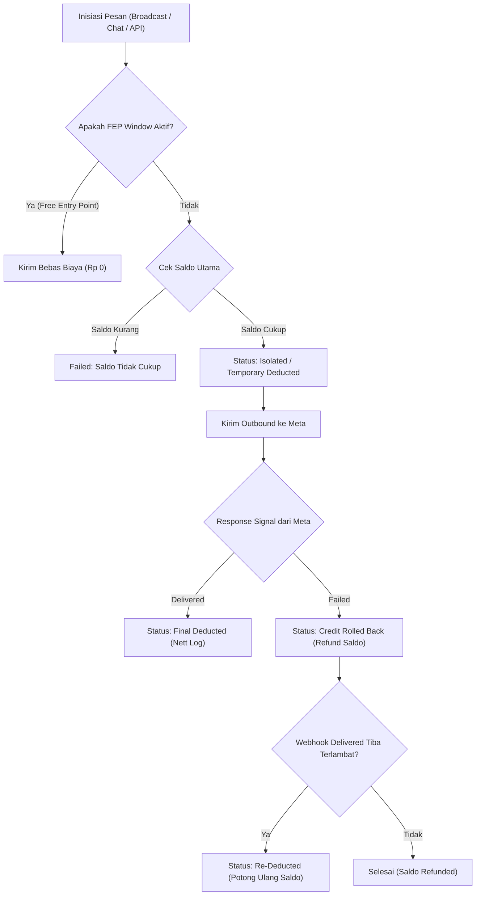

# Analisis PRD & Perancangan Test Matrix: Meta New Pricing 2026

Dokumen ini merupakan hasil analisis mendalam (*Evidence-Grade Analysis*) yang membedah kebutuhan fungsional, non-fungsional, matriks hak akses, *decision table*, siklus hidup kredit, serta penegakan batasan teknis untuk inisiatif **Meta New Pricing 2026** pada platform Everpro Chat. Seluruh ambiguitas logika bisnis telah divalidasi dan dikonfirmasi bersama tim produk.

---

## 1. Ringkasan Fitur & Scope Guardrails

### A. Tujuan Fitur
Penyesuaian struktur harga pesan berbayar WhatsApp Official (Meta) per 2026 yang mencakup:
1. Penambahan kategori penagihan baru yaitu **Service Message** (sebelumnya percakapan berbasis sesi).
2. Mekanisme penetapan harga berbasis database multi-tier (*Base Price* Meta + *General Markup* / *Custom User Markup*) yang berlaku efektif berdasarkan tanggal (`effective_at`).
3. Pengelolaan siklus kredit isolasi (*Credit Isolation*), *Rollback* otomatis saat pesan gagal, dan penyesuaian penagihan bersih (*Nett Credit Logging*).
4. Pemantauan pengeluaran bulanan (*Monthly Spend & Credit Limit*) serta visibilitas biaya per sesi dan kontrol limit chatroom (*Session Spend Limit & Top-up*).

### B. Arsitektur & Domain Platform
- **Domain Aplikasi**: Web Dashboard (Customer Dashboard & CRM Dashboard), Chatroom Web, Background Queue/Worker, dan Backend Database/API.
- **Referensi Struktur UI**: `./strukturmenu/dashboard-crm/`, `./strukturmenu/chatroom-web/`, `./strukturmenu/customer-dashboard/`.
- **Knowledge Acuan**: `./Testcase-support/[SSOT] Requirement for RBAC Customer Dashboard.xlsx`, `./Testcase-support/knowledge basic apps.md`.

### C. Batasan Ruang Lingkup (Scope Guardrails)
- **In-Scope**:
  - Validasi database pricing matrix (*Base Price, General Markup, Custom User Markup*) dan penegakan tanggal `effective_at`.
  - Log audit perubahan harga (*Actor, New Price, Category, Country, User ID, Timestamp*).
  - Pengecekan Free Entry Point (FEP) Window untuk menggratiskan 4 tipe pesan (*Marketing, Utility, Authentication, Service*).
  - Mekanisme *Credit Isolation*, *Credit Rollback* (saat signal failed dari Meta), dan *Re-deduct* (jika signal delivered tiba terlambat pasca-rollback).
  - Penanganan pengiriman broadcast dengan saldo parsial (kirim hingga saldo habis, sisanya gagal kirim).
  - Validasi gagal kirim pesan satuan di chatroom saat saldo kredit tidak cukup.
  - Integrasi Service Message pada total "Pengeluaran bulan ini", penegakan *Monthly Credit Limit*, dan ekspor file *Credit History* dengan kolom `TEMPLATE TYPE = Service`.
  - Tampilan *Ongoing Session Cost* real-time pada Chatroom Web.
  - Pengaturan flat session limit oleh Owner/Supervisor dan penambahan limit (*Top-up* Rp2.000, Rp5.000, Rp10.000) oleh Agent/Owner/Supervisor.
- **Out-of-Scope**:
  - UI Portal Biz Ops Admin untuk input harga (dikelola via database/backend request).
  - Segment-based / User-specific session limit pada chatroom (fase ini hanya menerapkan *flat generic session limit*).

---

## 2. Prasyarat Sistem & Konfigurasi Lingkungan (Pre-requisites)

1. **Paket Langganan**: Akun memiliki paket aktif **Chat** dan **CRM**.
2. **WhatsApp Official WABA**: Nomor WhatsApp Business terverifikasi dan terhubung ke akun Everpro.
3. **Master Saldo Kredit**: Tersedia saldo utama WhatsApp Credit pada akun (saldo bersama yang digunakan oleh seluruh WABA).
4. **Database Pricing Tables**: Tabel database terisi dengan data Base Price Meta, General Markup, dan Custom Markup beserta timestamp `effective_at`.

---

## 3. Matriks Hak Akses & Otorisasi Keamanan (RBAC Matrix)

| Modul / Fitur / Aksi | Biz Ops Admin | Owner | Supervisor | Agent (CS) | Direct API / Public |
| :--- | :---: | :---: | :---: | :---: | :---: |
| **Manage Base & Markup Price (DB/API)** | ✅ (Direct DB) | ❌ | ❌ | ❌ | ❌ (403 Forbidden) |
| **Audit Log Perubahan Harga** | ✅ | ❌ | ❌ | ❌ | ❌ (403 Forbidden) |
| **Kirim Broadcast Campaign** | ❌ | ✅ | ✅ | ❌ (Hidden/Disabled) | ❌ (403 Forbidden) |
| **Lihat Pengeluaran Bulan Ini (WABA)** | ❌ | ✅ | ✅ | ❌ (Hidden) | ❌ (403 Forbidden) |
| **Atur Monthly Credit Limit** | ❌ | ✅ | ✅ | ❌ (Hidden/Disabled) | ❌ (403 Forbidden) |
| **Download Credit Usage History** | ❌ | ✅ | ✅ | ❌ (Hidden) | ❌ (403 Forbidden) |
| **Akses Chatroom Web (Assigned Room)** | ❌ | ✅ (All Rooms) | ✅ (All Rooms) | ✅ (Assigned Only) | ❌ (401/403) |
| **Lihat Ongoing Session Cost** | ❌ | ✅ | ✅ | ✅ | ❌ (403) |
| **Atur Flat Session Limit Chatroom** | ❌ | ✅ | ✅ | ❌ (Hidden/Disabled) | ❌ (403) |
| **Top-up Limit Percakapan (Rp2k/5k/10k)** | ❌ | ✅ | ✅ | ✅ (Assigned Room) | ❌ (403) |

---

## 4. Pemodelan Logika Bisnis, State Transition & Decision Matrix

### A. Decision Table: Hierarki Penentuan Harga & Kalkulasi Kredit
Kalkulasi biaya per pesan: $\text{Biaya Akhir} = \text{Base Price Meta} + \text{Margin Markup}$, dibulatkan ke atas (*ceiling*) ke Rupiah bulat.

| Kondisi Custom User ID | Kondisi General Markup | Status `effective_at` | Harga yang Dikenakan ke Pesan | Status Eksekusi |
| :---: | :---: | :---: | :--- | :--- |
| Ada di DB (Rp 450) | Ada di DB (Rp 500) | $\le$ Timestamp Kirim | Custom Markup (Rp 450 + Base Price) | ✅ Override General |
| Tidak Ada di DB | Ada di DB (Rp 500) | $\le$ Timestamp Kirim | General Markup (Rp 500 + Base Price) | ✅ Standard Pricing |
| Ada di DB (Rp 450) | Ada di DB (Rp 500) | $>$ Timestamp Kirim (Future) | Menggunakan harga aktif sebelum tanggal baru | ✅ Old Pricing Active |
| Tidak Ada Custom/General | Tidak Ada di DB | - | Fallback / Blocker Alert (Tolak Pengiriman) | ❌ Block & Log Error |

---

### B. Decision Table: Eksekusi Pengiriman & Pengurangan Saldo Kredit

| Fitur / Channel | Status Window FEP | Kondisi Saldo Kredit Utama | Status Pesan di Meta | Tindakan Sistem & Dampak Saldo |
| :--- | :---: | :--- | :--- | :--- |
| **Broadcast (100 Target)** | Non-Aktif | Cukup untuk 100 pesan | All Delivered | Isolasi 100 pesan $\rightarrow$ Finalize Deduct 100 pesan. |
| **Broadcast (100 Target)** | Non-Aktif | Hanya cukup untuk 60 pesan | 60 Delivered | Kirim 60 pesan (Deduct 60), 40 pesan sisanya `Failed - Saldo Tidak Cukup`. |
| **Broadcast / Chat / API** | **Aktif (FEP)** | Berapa pun / Saldo 0 | Delivered | **Gratis (0 Biaya)**, tanpa isolasi & tanpa potong saldo. |
| **Chatroom (Kirim 1 Pesan)** | Non-Aktif | Saldo Kurang | - | Blokir kirim, bubble menampilkan *"Gagal kirim karena saldo tidak cukup"*. |
| **Semua Channel** | Non-Aktif | Cukup (Telah diisolasi) | **Failed Signal Meta** | **Otomatis Rollback** saldo kredit sebesar nilai isolasi. |
| **Semua Channel** | Non-Aktif | Telah di-rollback | **Late Delivered Signal** | **Re-deduct** saldo kredit sejumlah biaya pesan. |

---

### C. State Transition Lifecycle: WhatsApp Message Credit Flow

---

### D. Decision Table: Chatroom Session Limit & Top-up

| Ongoing Session Spend | Configured Flat Limit | Aksi Agent / User | Status Percakapan | Respon Sistem |
| :---: | :---: | :--- | :---: | :--- |
| Rp 8.000 | Rp 10.000 | Kirim pesan Service (Rp 500) | `Normal` | Pesan terkirim, Ongoing Cost menjadi Rp 8.500. |
| Rp 10.000 | Rp 10.000 | Kirim pesan berbayar | `Limit Reached` | **Blokir pengiriman pesan**, flag limit reached aktif di chatroom. |
| Rp 10.000 (Limit Reached) | Rp 10.000 | Agent pilih Top-up Rp 5.000 (Saldo cukup) | `Unblocked` | Limit sesi menjadi Rp 15.000, chatroom unblocked, log audit top-up tercatat. |
| Rp 10.000 (Limit Reached) | Rp 10.000 | Agent pilih Top-up Rp 5.000 (Saldo utama 0) | `Limit Reached` | **Top-up Gagal**: *"Saldo utama akun tidak mencukupi untuk top-up limit"*. |

---

## 5. Non-Functional Requirements, Integrasi Teknis & Error Handling

1. **Idempotency & Concurrency Guardrails**:
   - **Simultaneous Top-up**: Jika Agent dan Owner/Supervisor berada di room yang sama dan melakukan top-up Rp 5.000 secara bersamaan, sistem memproses kedua mutasi limit (total limit bertambah Rp 10.000) selama saldo kredit utama mencukupi.
   - **Broadcast Dispatch Idempotency**: Scheduler broadcast wajib menggunakan penguncian *distributed lock (Redis/DB mutex)* untuk mencegah pengiriman pesan ganda saat cron job trigger secara paralel.
2. **API & Webhook Resiliency**:
   - Webhook Meta untuk status *delivered* / *failed* harus bersifat idempoten (pengecekan ID pesan unik).
   - Penanganan *Re-deduct* saat status *delivered* datang terlambat setelah *rollback* dilakukan dengan mencatat baris mutasi kredit baru bertipe `RE_DEDUCTION`.
3. **Data Persistence & Audit Logging**:
   - Setiap perubahan harga oleh Biz Ops wajib mencatat: `actor_id`, `new_base_price`, `new_markup_price`, `message_category`, `country_code`, `target_user_id`, dan `timestamp`.
   - Setiap penambahan limit oleh Agent wajib mencatat: `agent_id`, `room_id`, `amount_added`, `previous_limit`, `new_limit`, dan `timestamp`.
4. **Rounding & Currency Standards**:
   - Seluruh nilai tagihan dan saldo disimpan dalam mata uang Rupiah bulat (Integer) dengan pembulatan ke atas (*ceiling*).

---

## 6. Requirements Traceability Matrix (RTM)

| User Story ID | Acceptance Criteria (AC) | Deskripsi Kebutuhan | Target Modul / Layer | Rencana Prioritas |
| :--- | :--- | :--- | :--- | :---: |
| **US-01** | AC-1, AC-2, AC-3 | Pengaturan Base Price & Markup (General & Custom) + Effective Date | DB / API Backend | **P1 (Critical)** |
| **US-01** | AC-4 | Audit Logging Perubahan Harga | DB / Audit Trail | **P2 (High)** |
| **US-02** | AC-1 | Free Entry Point (FEP) Window menggratiskan 4 tipe pesan | Scheduler / Chat / API | **P1 (Critical)** |
| **US-02** | AC-2 (a) | Credit Isolation & Perhitungan Tarif (Base + Margin) | Billing Worker | **P1 (Critical)** |
| **US-02** | AC-2 (b) | Credit Rollback saat Pesan Gagal di Meta & Re-deduct Late Delivery | Webhook Handler | **P1 (Critical)** |
| **US-02** | AC-3 | Nett Credit Logging & Export Credit History | Billing / Credit Report | **P2 (High)** |
| **US-03** | AC-1 | Pengeluaran Bulan Ini mencakup Service Message | UI Customer Dashboard | **P2 (High)** |
| **US-03** | AC-2 | Penegakan Monthly Credit Limit & Blokir Kirim | Billing / Message Validator | **P1 (Critical)** |
| **US-03** | AC-3 | Download Credit Usage History dengan Template Type = Service | UI / Export Engine | **P2 (High)** |
| **US-04** | AC-1 | Tampilan Ongoing Session Cost Real-Time | UI Chatroom Web | **P2 (High)** |
| **US-04** | AC-2 | Konfigurasi Flat Session Limit oleh Owner/Supervisor | UI / Chatroom Settings | **P2 (High)** |
| **US-04** | AC-3 | Pemblokiran Pesan Berbayar saat Limit Sesi Tercapai | UI Chatroom & Validator | **P1 (Critical)** |
| **US-04** | AC-4 | Manual Limit Top-up oleh Agent (Rp2k/Rp5k/Rp10k) | UI Chatroom & Billing | **P1 (Critical)** |

---

## 7. Dampak Regresi (Impact & Regression Scope)

1. **Modul Broadcast Campaign**: Potensi regresi pada scheduler pengiriman broadcast lama dan kalkulasi estimasi saldo.
2. **Chatroom Core Messaging**: Potensi regresi pada pengiriman chat biasa (teks/media/template) akibat penambahan layer pengecekan session cost limit dan FEP.
3. **Billing & Credit Management**: Potensi regresi pada laporan mutasi saldo, top-up saldo utama, dan riwayat pemotongan kredit existing.
4. **OpenAPI / Webhook API**: Potensi regresi pada endpoint pengiriman pesan pihak ketiga yang menggunakan integrasi API langsung.

---

## 8. Catatan Klarifikasi & Keputusan Produk (Clarification & Alignment Log)

Berikut adalah rangkuman keputusan resmi hasil klarifikasi bersama tim produk:
1. **Durasi Buffer Rollback Kredit**: Mengacu langsung pada respon signal failed dari Meta; kredit segera di-rollback saat status failed diterima.
2. **Prioritas Hierarki Harga**: Custom Markup (per `user_id`) memprioritaskan override 100% dari General Markup.
3. **Mata Uang & Pembulatan**: Menggunakan mata uang Rupiah bulat dengan pembulatan ke atas (*round-up/ceiling*), berlaku efektif per `effective_at`.
4. **Portal Biz Ops Admin**: Pengaturan harga dikelola via backend/database (tidak ada UI BizOps pada fase ini).
5. **Segmentasi Pelanggan**: Sesi chatroom menerapkan *flat default session limit* tanpa pembagian segmen pelanggan.
6. **Batas Top-up Agent**: Agent dapat melakukan top-up berulang kali tanpa batas maksimum, selama saldo utama WhatsApp Credit akun mencukupi.
7. **Kewenangan Flat Limit**: Pengaturan nilai flat limit utama hanya dapat dilakukan oleh Owner/Supervisor; Agent hanya berwenang menambah limit (*top-up*) per room yang di-assign.
8. **Saldo Kurang saat Broadcast**: Sistem mengirimkan pesan sebanyak kuota saldo tersisa (FIFO), dan nomor sisanya berstatus `Failed - Saldo Tidak Cukup`.
9. **Keterlambatan Webhook Pasca-Rollback**: Sistem akan melakukan *Re-deduct* otomatis jika signal *delivered* tiba terlambat setelah kredit di-refund.
10. **Simultaneous Top-up**: Mutasi top-up bersamaan oleh Agent dan Owner/Supervisor diproses keduanya selama saldo utama akun mencukupi.
11. **Masa Aktif FEP**: Berlaku gratis untuk 4 tipe pesan (*Marketing, Utility, Auth, Service*) setelah agent merespon percakapan dari Free Entry Point.
